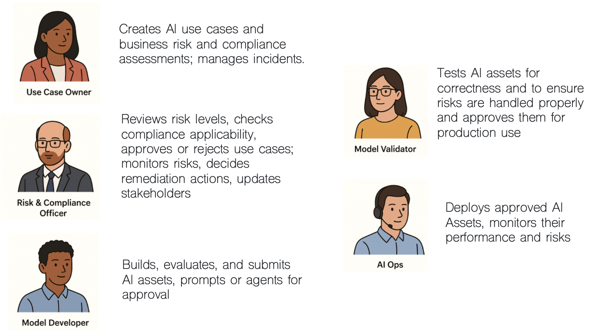
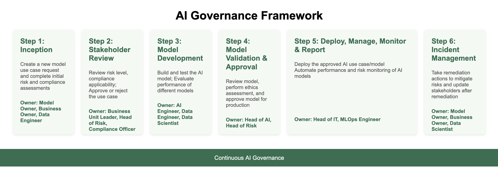
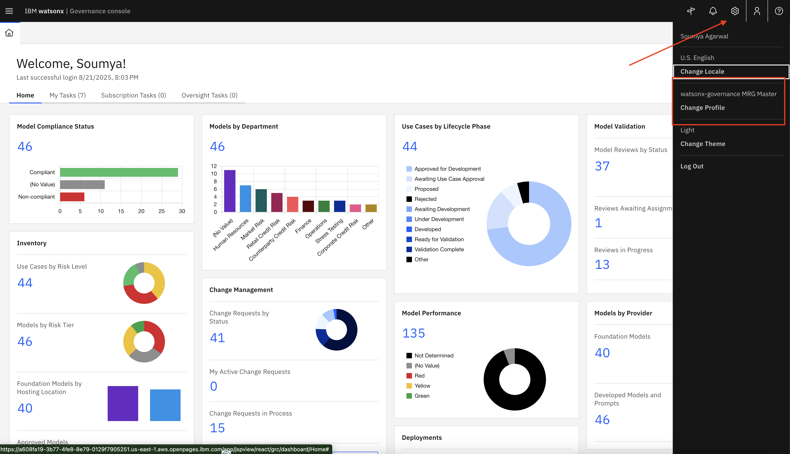

# 🧑‍💼 Managing AI Risk and Compliance with watsonx.governance

-------

## Table of Contents
- [Introduction](#introduction)
- [Hands-on step-by-step lab](#hands-on-lab)
- [Guide directory](./guides-directory.md)
- [Credential directory](./credential-directory.md)

-------
# Introduction

## 👋 Meet Jose – The Chief Risk Officer

Jose works at **TechCorp Inc.**, a large multinational enterprise using AI to improve HR processes like hiring and employee planning.

But there was a problem...  
AI was everywhere, but **nobody really knew**:
- Who built what
- Whether the models were fair
- If they followed rules like GDPR etc.
- What to do when something went wrong

Jose was responsible for managing all that risk — but he had **no clear way** to do it.

So, Jose and his team decided to leverage **watsonx.governance** to make AI governance easy, clear, and reliable.

## 🎯 What Jose Wanted to Fix

Jose didn’t want to manage critical governance processes through spreadsheets, emails or slack messages. 

He wanted a simple system that would:

- ✅ **Track every AI model from start to finish**
- ✅ **Make sure models follow the rules (like GDPR, EU AI Act, etc.)**
- ✅ **Foster collaboration with the development team — without slowing them down**
- ✅ **Catch problems early and fix them fast**
- ✅ **Keep everything ready for audits**

And that’s where **watsonx.governance** helps.

## 👥 Who's involved in AI Governance?

AI Governance is a teams sport involving different roles in an organization. Though it's not uncommon to find scenarios where folks could perform the roles of severals personas, here's what these roles might look like:

*Note:* For simplicy, your single user will impersonate all those personas during the Bootcamp Lab.

## 🚀 The AI Governance Journey in 7 steps (Used by Jose’s Team)

A simple, structured process for managing AI models from idea to remediation.

<!--
| 👤 **Role**               | 💡 **What They Can Do**                                                                 |
|--------------------------|------------------------------------------------------------------------------------------|
| **Use Case Owner**       | Create model use case, complete risk and compliance assessments, manage incident updates |
| **Stakeholders**         | Review risk levels, check compliance applicability, approve or reject use cases          |
| **Model Developer**      | Build, evaluate, and submit AI models for approval                                       |
| **Model Validator**      | Review model ethics and fairness, approve for production                                 |
| **Operations (IT/MLOps)**| Deploy approved models, monitor model performance and risks                              |
| **Risk & Compliance Officer** | Monitor risks, decide remediation actions, update stakeholders                     |

<!--
## � Summary of Stakeholder Actions

| Stakeholder Role            | Key Responsibilities                                              | Reference Guide |
| --------------------------- | ----------------------------------------------------------------- | --------------- |
| **Model Owner**             | - Create business entity - Define use case - Submit risk    | - [Create Business Entity](./steps/step1/business-entity-creation-use-case-owner.md) - [Submit and Define Use Case](./steps/step1/usecase-creation-model-owner.md) |
| **Risk Compliance Officer** | - Review and assess risk for compliance                           | - [Review and Assess Risk](./steps/step1/risk-review-rco.md) |
| **Business Unit Leader**    | - Endorse or reject risk based on alignment with strategy         | - [Stakeholder Risk Endorsement](./steps/step2/risk-endorsement-bul.md) |
| **Model Developer**         | - Create and evaluate prompts and agents for GenAI use cases      | - [Model Developer Tasks and Guidelines](./steps/step3/model-developer-tasks.md) |
| **Model Validator**         | - Validate model performance and fairness via OpenScale dashboard | - [Model Validator Tasks and Evaluation Guide](./steps/step4/model-validator-tasks.md) |
-->
### 🔹 Step 1: Use Case Creation
**Who:** Use Case Owner (Model Owner, Business Owner, Data Engineer)  
- Submit a new model use case request  
- Complete initial risk and compliance assessments  

📦 *Module: Use Case Management*

---

### 🔹 Step 2: Review Risk & Compliance  
**Who:** Stakeholders (Business Unit Leader, Head of Risk, Compliance Officer)  
- Evaluate risk level and compliance applicability  
- Approve or reject the use case  

📦 *Module: Stakeholder Review*

---

### 🔹 Step 3: Develop the Model  
**Who:** Model Developer (AI Engineer, Data Engineer, Data Scientist)  
- Build and test multiple AI models  
- Submit the best model for validation  

📦 *Module: Model Development*

---

### 🔹 Step 4: Validate the Model  
**Who:** Model Validator (Head of AI, Head of Risk)  
- Perform ethics and fairness assessments  
- Approve model for production use  

📦 *Module: Model Validation & Approval*

---

### 🔹 Step 5: Deploy and Monitor the Model  
**Who:** Operations Team (Head of IT, MLOps Engineer)  
- Deploy the approved AI model to production  
- Ensure deployment is traceable to governance  
- Monitor model performance and risk continuously  
- Trigger alerts and reports for anomalies  

📦 *Module: Deployment Tooling*

---

### 🔹 Step 6: Manage Incidents  
**Who:** Use Case Owner & Compliance Team  
- Take remediation actions for issues and risks  
- Update stakeholders after resolution  

📦 *Module: Incident Management*

-----

## 💬 What Jose Says Now

> _“Before watsonx.governance, we had no clear process. Now everyone knows what to do, models are better, and we’re always ready for audits.”_

------
-------

# 📄 Hands-on step-by-step lab

## ⚙️ Pre-requisites

* Access credentials (provided by the instructor)
* IBM Cloud login with assigned stakeholder role
* Services: OpenPages with MRG loaded with Sample Data.
* Instructor to act as Model developer, deployer and user using watsonx.
<!--* Instructor access to orchestration scripts-->

## 🚀 Getting Started

1. Login to [IBM Cloud](https://cloud.ibm.com)
2. Navigate to **Resource List > AI / Machine Learning**
3. Launch the **OpenPages** instance from the list.   
*If you receive an authorization error, add **/app/jspview/react/grc/dashboard/Home** to the end of the URL.*

<!--
> 
-->

> [!Important]
> After logging make sure to check in Profile that it has to be set as **Watsonx governance MRG Master**:

In this lab, you will impersonate all the users. We haven't created a profile for each of the personnas. You are indeed accessing a vanilla OpenPages with the MRG application provisionned on it. This comes with a collection of default profiles. The Profiles **watsonx governance MRG Master** will enable you to run through all the labs without having to switch profiles or users.

> 🔐 **Note:** Make sure you're logged in as the appropriate role before proceeding with assigned tasks.

## 👩‍💼 Step 1 - Use Case Owner Responsibilities

As a UseCase Owner, your responsibilities include:

* Defining the use case (AskHR - Agentic AI)
* Submitting associated risks for approval  

🔍 Follow these guides:

* [Creating and defining an AI use case](./steps/step1/usecase-creation-model-owner.md)
* [Reviewing and Assessing Risk](./steps/step1/risk-review-rco.md) and ensure they comply with regulatory and organizational standards.

Once the guides above have been completed, the Use Case Owner would wait for steps 2-6 to be completed by other roles (development and deployment) up until an incident or issue is reported.
In our scenario, one issue will arise once the model in in production.  

💡 Don’t forget to fill in the **Risk Level** and **Control Details** before submission.

## 👤 Step 2 - Business Unit Leader Responsibilities

As a Business Unit Leader, you play a crucial role in stakeholder endorsement. Your input ensures the use case aligns with business strategy and acceptable risk levels.

> ⚠️ **Note:** You must be logged in as **Business Unit Leader** to access this flow.

✅ Steps to Review:

1. Go to `My Tasks` → `Stakeholder Review`
2. Open the assigned Use Case or Risk
3. Review the risk and RCO assessment
4. Leave comments (if needed)
5. Approve if compliant or reject if misaligned
6. Submit your review

🗂️ Follow this guide:

* [Stakeholder Risk Endorsement](./steps/step2/risk-endorsement-bul.md)

## 👨‍💻 Step 3 - Model Developer Responsibilities

As a Model Developer, your responsibilities focus on creating and evaluating Prompts and Agents for generative AI use cases. You will build and test these artifacts in the Prompt Lab and Agent Lab. Upon creation, a Factsheet is automatically generated and linked to Watsonx.governance.

You are responsible for completing any required details in the factsheet and submitting it for governance approval.

**🔐 Note:** Make sure you're logged in as Model Developer to access Prompt and Agent Labs.

🗂️ Reference:

* [Model Developer Tasks and Guidelines](./steps/step3/model-developer-tasks.md)

## 🔍 Step 4 - Model Validator Responsibilities

As a **Model Validator**, you are responsible for monitoring and validating the AI model’s performance and fairness metrics on the **IBM Watson OpenScale** dashboard. You will review alerts related to fairness, quality, drift, and explanations to ensure the model meets governance standards.

<!--
### Key Actions:

* Log in as **Model Validator / AI Engineer**
* Navigate via **Hamburger Menu → Instances → openscale-defaultinstance**
* Open **IBM Watson OpenScale** by clicking **Open** (top right)
* Review model performance metrics for fairness, quality, and drift (focus on triggered alerts and violations; raw scores are not the primary concern)
* Evaluate the model by uploading test data provided by your instructor:

  * Click **Actions → Evaluate now**
  * Upload a CSV file containing input and expected output (ground truth)
  * Wait for evaluation to complete
* Submit feedback or observations for governance reporting

### Notes on Evaluation Dataset:

* Max size: 8 MB
* Record limits: Minimum 10, Maximum 1000
* Dataset provided by instructor
-->

🗂️ Reference:

* [Model Validator Tasks and Guidelines](./steps/step4/model-validator-tasks.md)

  
## 🔍 Step 5 - AIOps Engineer Responsibilities

As a **AIOps Engineer**, you are responsible for Deploying and Monitoring the AI use case/model on **IBM Watsonx Governance** .

🗂️ For detailed steps, refer to:

* [Operations Team Tasks and Evaluation Guide](./steps/step5/model-deployer-tasks.md)

## 🔍 Step 6 - Use Case Owner Responsibilities

As a **UseCase Owner**, you are also responsible for reviewing incident and issue that may arise along all the lifecyle of a model. In that scenario, an issue arises while the model is in production. Your task is to review the issue and mitigate.

* [Mitigating Incidents](./steps/step6/mitigating-incidents.md)

--------

## 🎉 Congratulations!

You've helped ensure this Agentic AI use case adheres to ethical AI practices by:

* Validating risk levels
* Confirming regulatory and internal compliance
* Approving only well-governed use cases
* Ensuring model fairness and quality through continuous validation

> 🛡️ Governance is not a one-time check — it’s a continuous loop of accountability and alignment.

