# 🛡️ Risk Review Process for Use case owner

> ⚠️ **Login Note:** Make sure you are logged into **IBM OpenPages** using the **Use case owner** role before starting this task.

 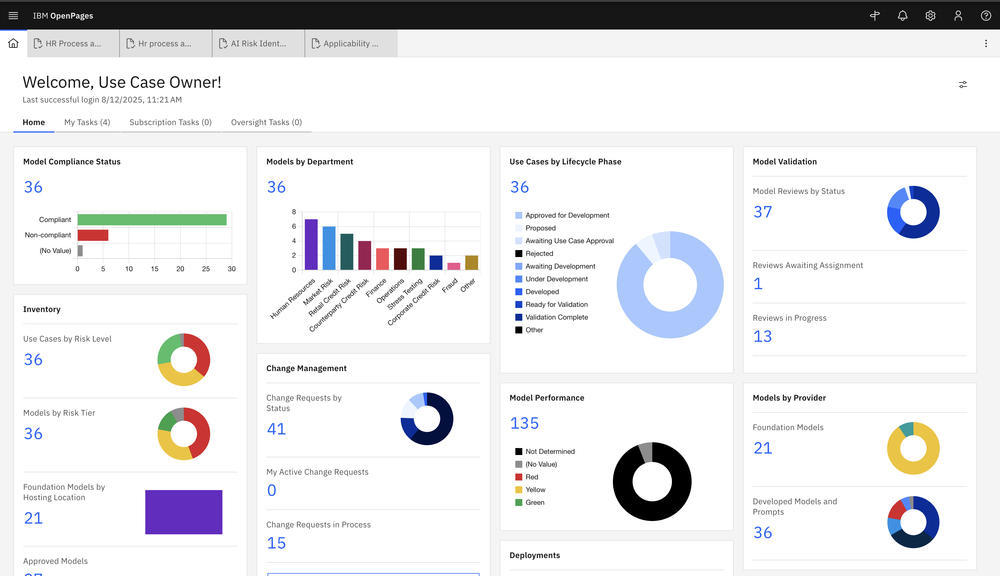
 
> This role is required to review and approve risks submitted by the Use Case Owner.

---

## 📌 Overview

As a **Use Case Owner**, your responsibility is to review risks submitted as part of a Use Case and determine the appropriate risk status. This process ensures that all risks are evaluated, documented, and aligned with your organization's governance standards.

---

## 🧩 Workflow Context

This step occurs **after** a Use Case Owner:

* Creates a  Use Case, and
* Submits a Risk Identification Assessment.

You will now:

* Review the submitted risk,
* Perform assessments if necessary,
* Update the status, and
* Forward the task for stakeholder approval.

🧭 Steps:

| Step               | Action                        | Status Update                 |
| ------------------ | ----------------------------- | ----------------------------- |
| Risk Received      | Review risk description       | `Awaiting Assessment`         |
| Perform Assessment | (Optional) Add documentation  | `Awaiting Approval`           |
| Finalize Decision  | Approve / Mark Not Applicable | `Approved` / `Not Applicable` |

---

## 🛠️ Step-by-Step Task Instructions

### 1️⃣ Risks are populated and now **Use Case Owner** can review each risk:

  

---

### 2️⃣ Start Risk Assessement

* Open the risk record.
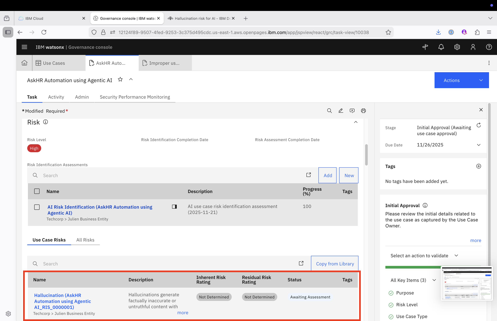

* Click on **Start Model Risk Assessment**, available on the Actions button. Click on Continue.

Then, click on the option **Ready for Assessment**, available on the Actions button.
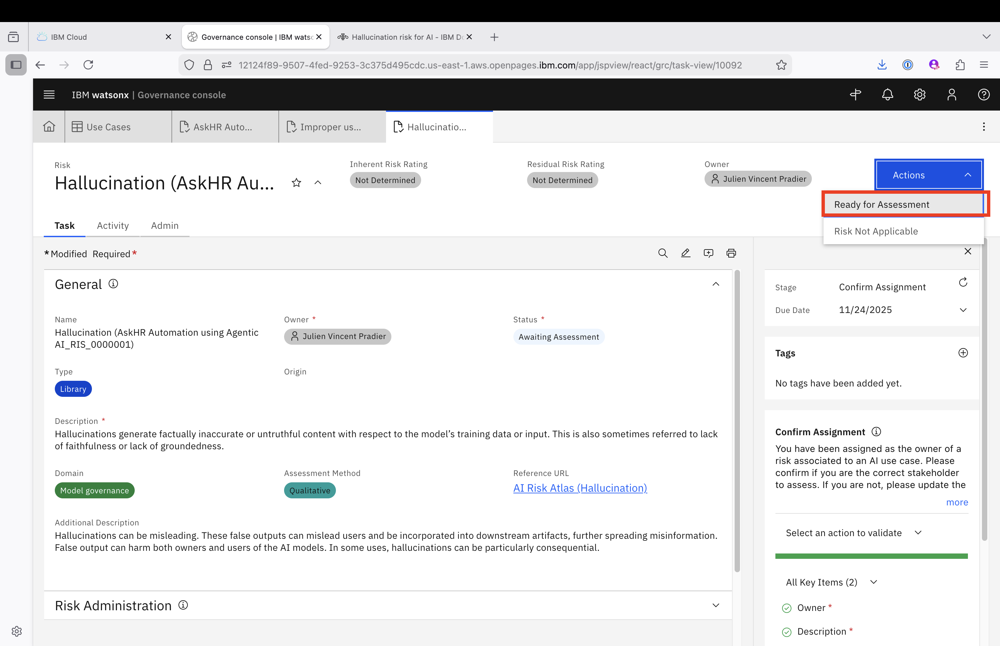

---

### 3️⃣ Decide if a Risk Assessment is Required

| If...                   | Then...                                         |
| ----------------------- | ----------------------------------------------- |
| Assessment is required  | Proceed to fill in the Risk Assessment section. |
| No assessment is needed | Move directly to setting the risk status.       |

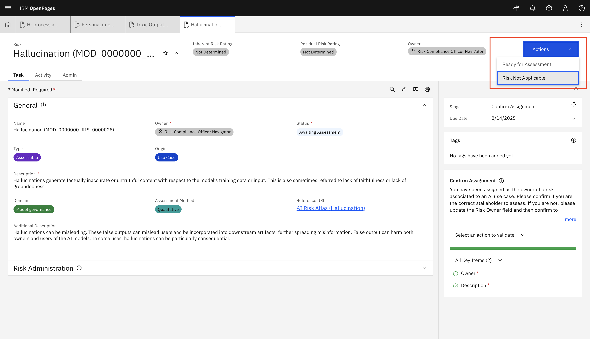

---

### 4️⃣ Perform Risk Assessment

* Open the risk record.
 
* Fill the field values including:

  * Risk Title
  * Description
  * Risk Category
  * Potential Impact
  * Mitigation Strategy
  * **Inherent Risk Rating** : This can be done by setting the Inherent Impact
  * **Residual Risk Rating** : This can be done by setting the Residual Impact
  

* Save and click on **Asssement Complete**:
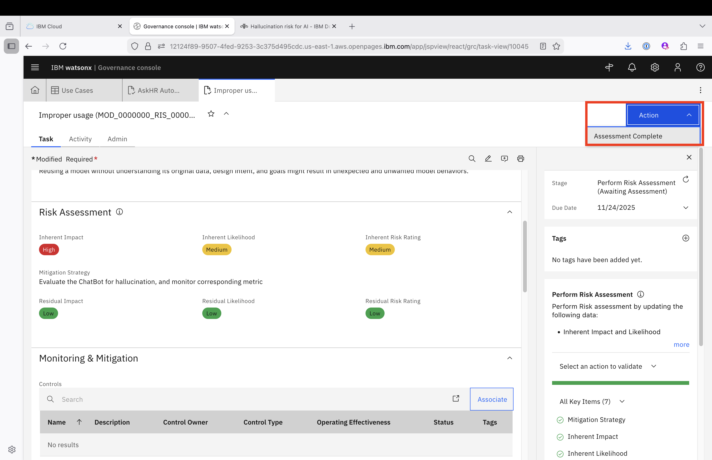

* Choose **Continue and close tab**
---

---

### 5️⃣ Save and Complete the Task

* After completing all risk review. Go to actions and click **Submit for Stakeholder Review** to progress the workflow to the Stakeholder stage.

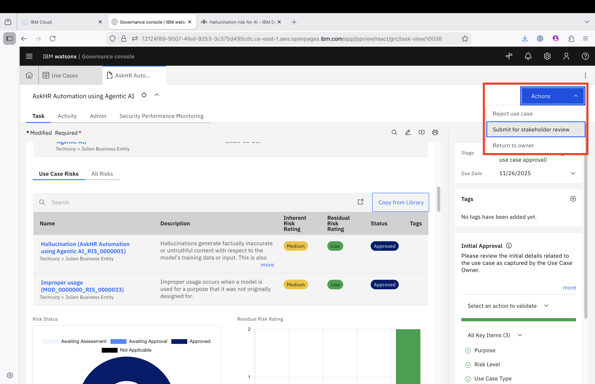

####  Process Several Risks - Bulk Operation

Nota: 
Please proceed with the following procedure If the message is displayed when submitting the case for stakeholder review. : "All associated risks should be assessed (marked as "Approved" or "Not Applicable") before submitting this use case for stakeholder review."

* Click on the Launch Grid Page section
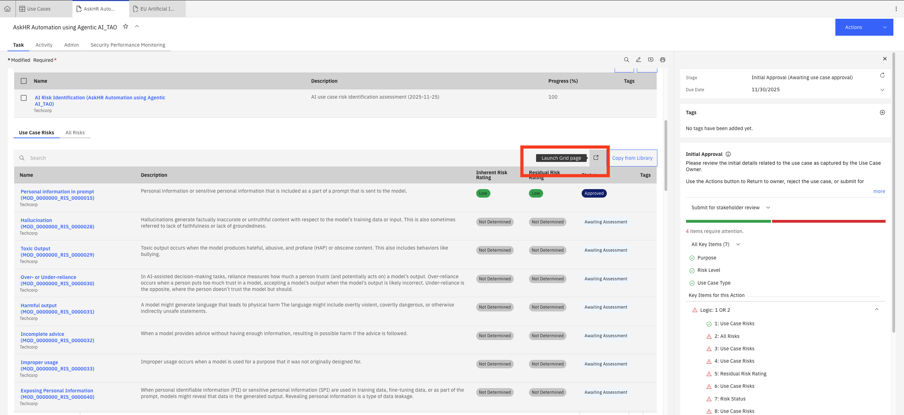

* Select all the risk with status "Awaiting Assessment", then click on "Bulk update"
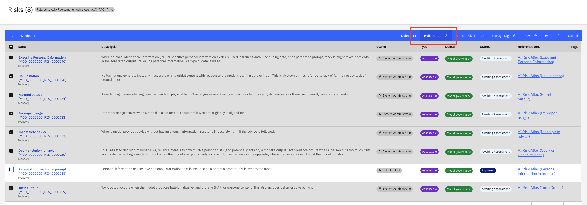

* Select field "Status", then click on "Not Applicable". Then, click on the button "Update"
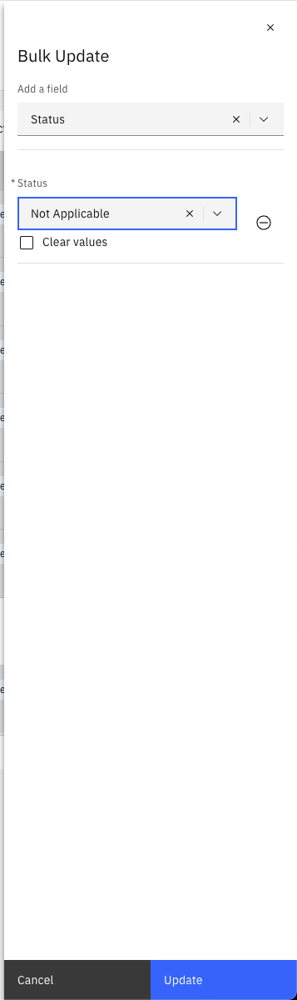

* Close the confirmation window
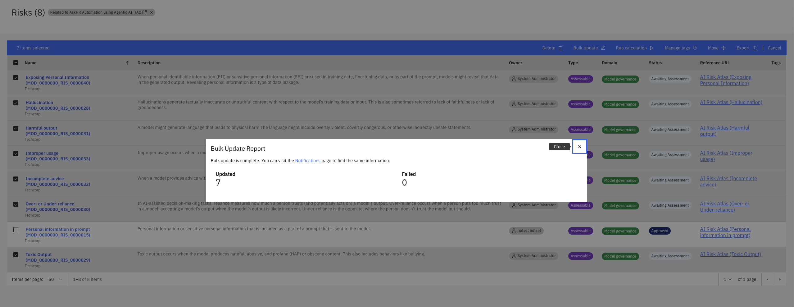

* Close the risk window tab.
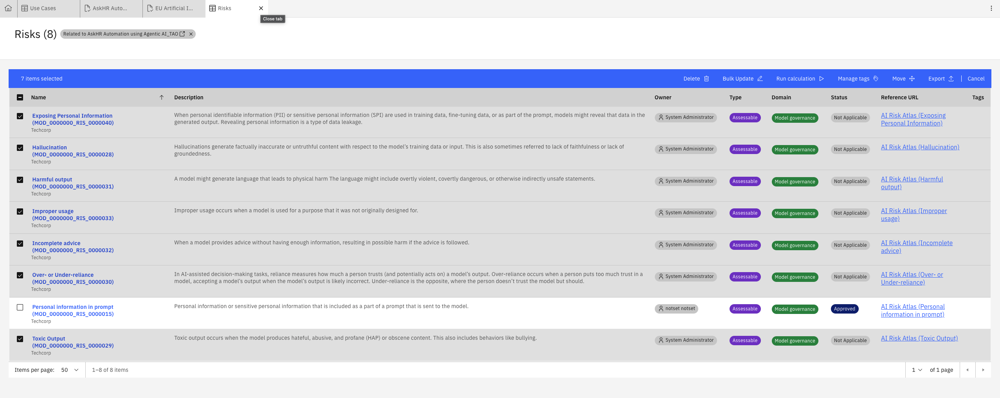

* Re-Open the Case. Go to actions and click **Submit for Stakeholder Review** to progress the workflow to the Stakeholder stage.

---

## 📋 Summary Table

Here are the different action to be taken depending on the Risk Status:

| **Scenario**                   | **Status Set To**     |
| ------------------------------ | --------------------- |
| Still under review             | `Awaiting Assessment` |
| Assessment completed           | `Awaiting Approval`   |
| Risk is accepted and validated | `Approved`            |
| Risk is not relevant           | `Not Applicable`      |

---

## ✅ Example

A typical Risk Compliance review might follow this path:

1. Risk received → Review details.
2. Determine assessment is needed → Fill in assessment form.
3. Set status to **Awaiting Approval**.
4. Save and complete the task.

---

## 🎉 Well Done!

By completing the **Risk Compliance review**, you help ensure:

* Risks are properly assessed and documented,
* Compliance is upheld,
* The organization follows a consistent and accountable risk management process.

---

[← Back to main guide](../../README.md)
[← Back to directory](../../guides-directory.md)

