# 📊 Creating Use Cases in watsonx.governance

> ⚠️ **Login Note:** Before starting, ensure you are logged into **IBM Governance Console** with the **Use Case Owner** role.
> This is required to create and manage Model Use Cases and associated risk/compliance workflows.

---

## 📌 What is a  Use Case?

A **Use Case** in IBM Governance Console is used to document and govern one or more models developed to fulfill a specific business objective. It acts as a centralized record for model development, compliance, risk tracking, and approval workflows.

> ✅ **A Use Case should be created whenever there's a business requirement that needs one or more AI/ML assets (e.g., models, prompts, or agents).**

---

## 🎯 Why Create a Use Case?

Creating a Use Case helps:

* Centralize governance of related models.
* Manage risks, compliance requirements, and ownership in one place.
* Track model performance and approvals across the model lifecycle.
* Link models to Business Entities for traceability and audit readiness.

---

## 🛠️ Step-by-Step Guide to Create a Use Case

### 1️⃣ Navigate to the Use Case Section

* Log in to IBM OpenPages as **Model Owner**.
* Click on the **Hamburger Menu (☰)**.
* Go to **Inventory**.
* Select **Use Case**.

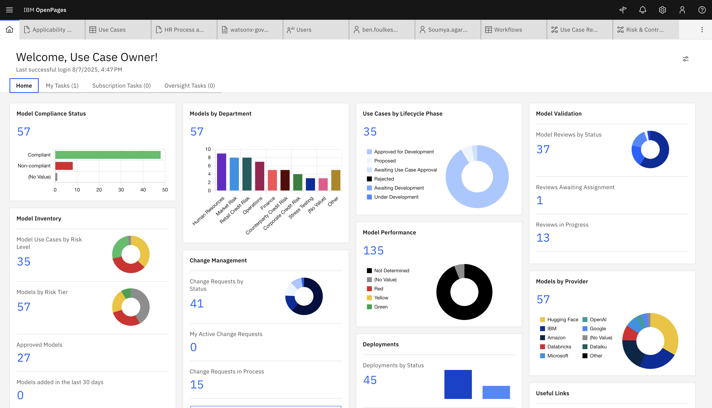

---

### 2️⃣ Click **“Create New”**

* Click the **Create New** button at the top of the Use Case list view.

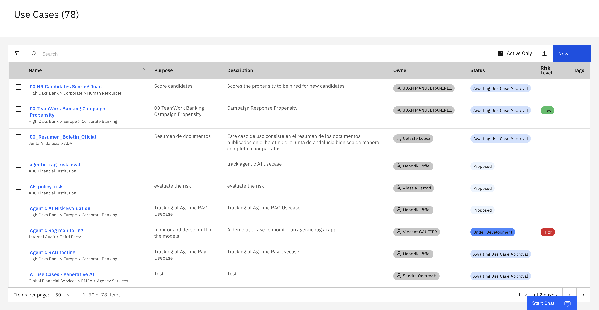

---

### 3️⃣ Fill in the Required Fields

Fill in the form using the following example:

| Field                       | Example Entry                                   |
| --------------------------- | ----------------------------------------------- |
| **Name**                    | <trigram*>_AskHR Automation using Agentic AI       |
| **Owner**                   | Use Case Owner : select user used to log into the platform - e.g studentxx@techzone.ibm.com.                                     |
| **Purpose**                 | Automate HR processes using Generative AI.      |
| **Description**             | This use case tracks GenAI-based HR automation. |
| **Primary Business Entity** | Techcorp                                        |
| **Use Case Type** | AI                                        |

> *trigram:  three-letter acronym of your name (first letter) and last name (first letter and last letter). e.g : Andrew Smith -> ASH

> ⚠️ All required fields must be completed before you can save.

---

### 4️⃣ Save the Use Case

* Click **Save** to create and register the Use Case record.

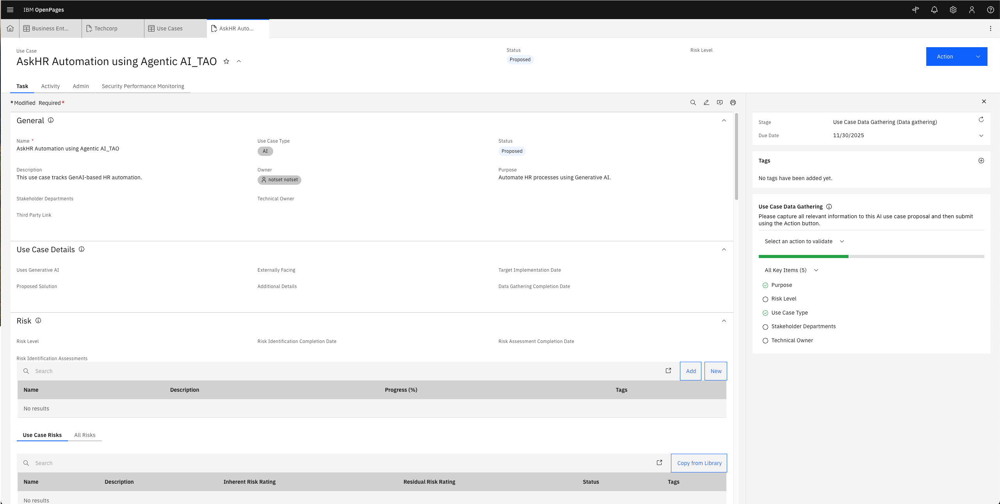

---

### 5️⃣ Set Technical Owner, Stakeholder Department

After saving:

* Open the newly created Use Case.
* Select the **Technical Owner**
* Select the **Stakeholder Department**
* Click **Save** again.

**Note:** you can also set the risk level if you know it. This is optional and does not block the workflow. 
* Scroll down to the **Risk** section.
* Select an appropriate **Risk Level** (Low, Medium, or High).

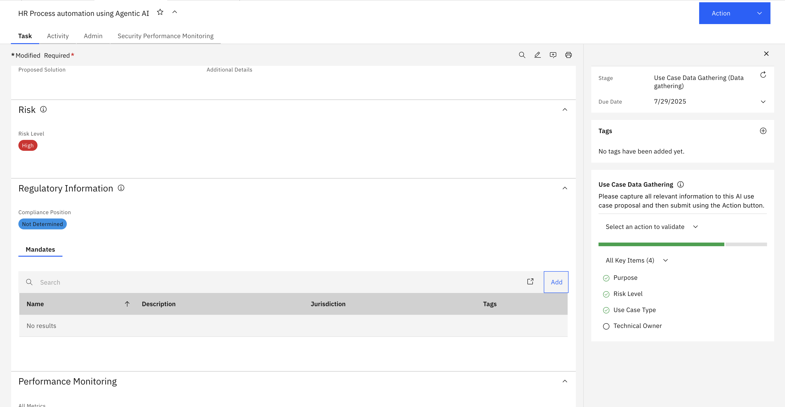

---

## ✅ Example Use Case Summary

| Field               | Value                                    |
| ------------------- | ---------------------------------------- |
| **Name**            | <trigram*>_AskHR Automation using Agentic AI        |
| **Owner**           | Use Case Owner : select user used to log into the platform. - e.g studentxx@techzone.ibm.com.                           |
| **Purpose**         | Automate HR tasks using Generative AI    |
| **Description**     | Tracks GenAI model for internal HR tasks |
| **Business Entity** | Techcorp                                 |
| **Risk Level**      | High                                     |
| **Use Case Type** | AI                                        |
| **Technical Owner** | Technical Case Owner : select user used to log into the platform.                                        |
| **Stakeholder Department** | Model Risk                                     |

After setting the risk level Go on action tab and click on **Submit for initial approval**

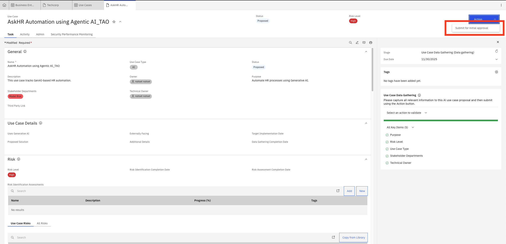

**Click on the button "Continue" in the popup window**

### 6️⃣ Open the Questionnaire Assessment 

There are several ways to open the Questionnaire Assessment, the most optimal is to open the Risk Assessment directly from the Use Case. Search for the Risk Section.

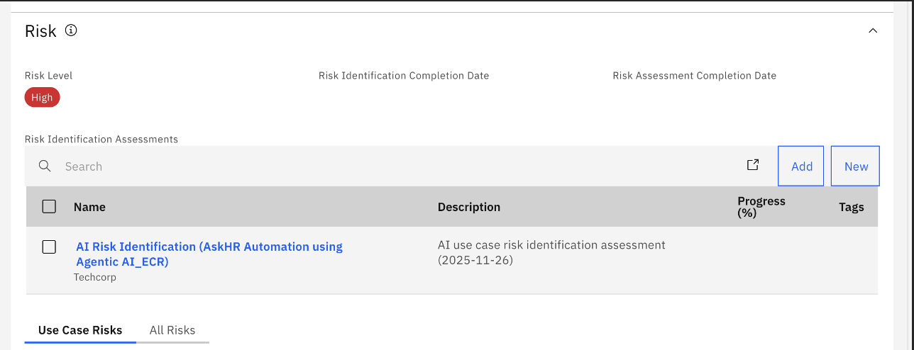  

Other way is to open the Questionnaire Assessment from the the task menu. Go to home, then "My Task"

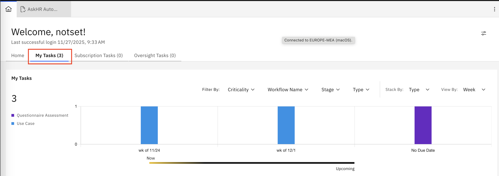  

Other way is to open the Questionnaire Assessment from the main menu.
* Click on the **Hamburger Menu (☰)**.
* Go to **Assesment**.
* Select **Questionnaire Assessment**.

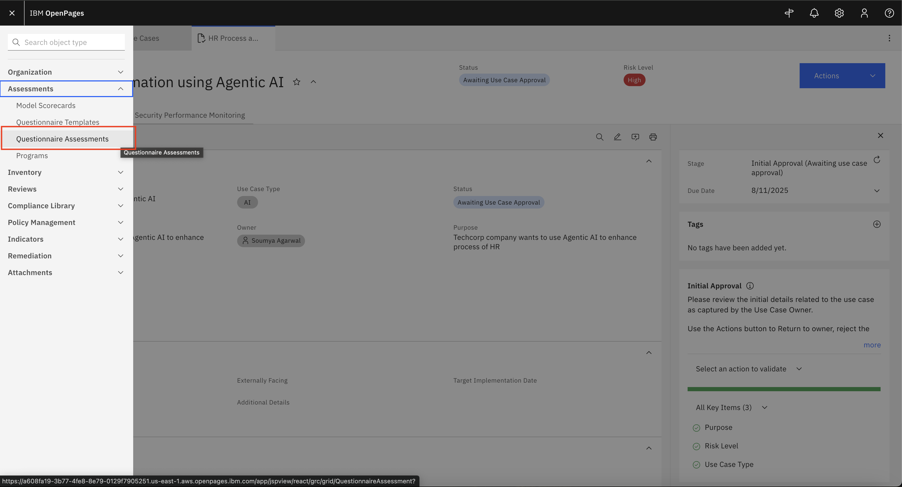  

### 7️⃣ Complete Risk Assessment

In the Questionnaire Assessment page,

* Click on the Risk Assessment associated with the Use Case.

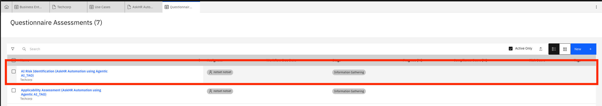  

* Fill out all required questions in the Risk Assessment Questionnaire, such as:

  a.What type of data is being used?

  b.Is the Use Case customer-facing?

  c.What is the impact of a model failure?

  d.What mitigations are in place?

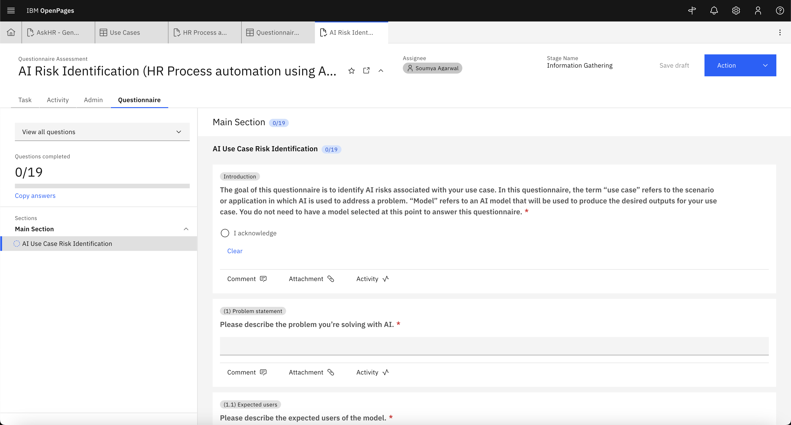

* Use dropdowns, radio buttons, and text fields as applicable.

  a. Make sure you answer to select yes to the question "Will the model input include content provided or created by people?"

  b. Then, select yes for the question "Will the model input include personal information?"

* Click **Submit and close** on Actions tab once all questions are answered.

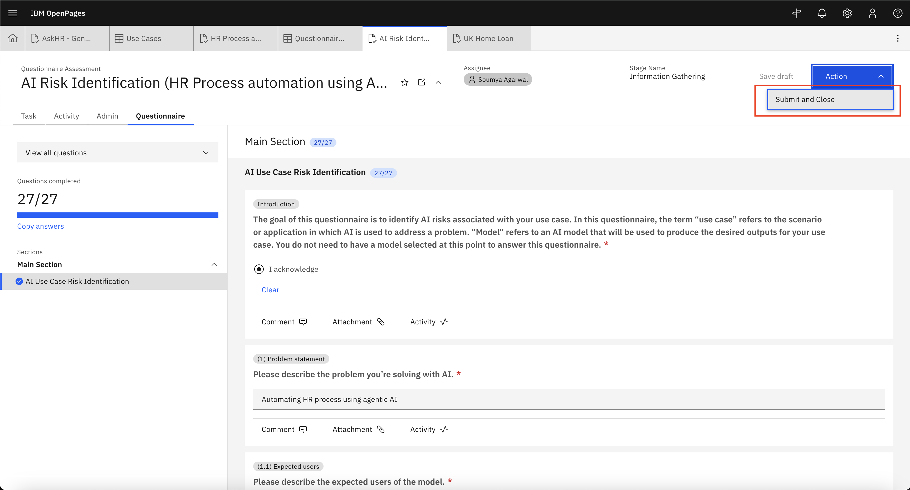 

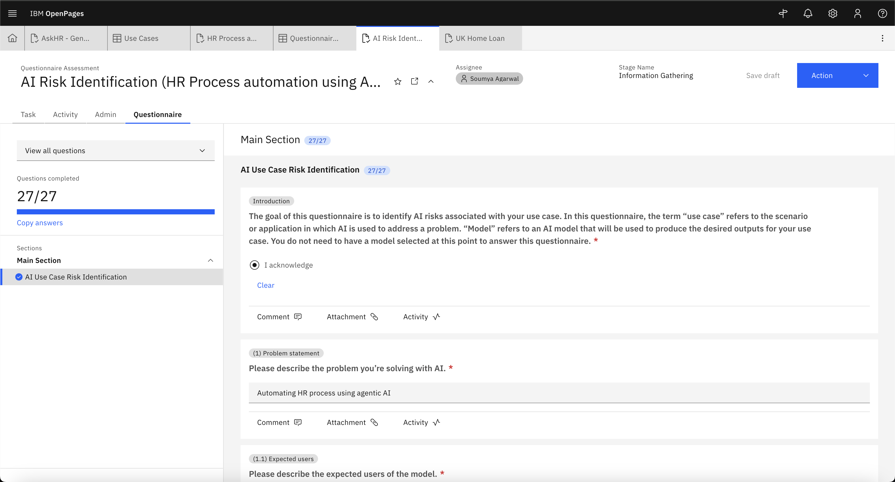  

#### Copy Answers

**NB** : You can copy the answers from another assessment using the **Copy answers** option available in the assessment.
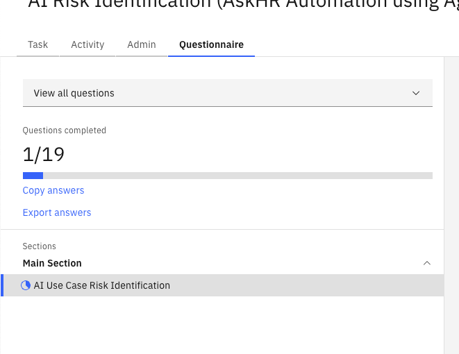

### 8️⃣ Complete Compliance Assessment

In the Questionnaire Assessment page,

* Click on the Compliance Assessment associated with the Use Case.(EU AI ACT)

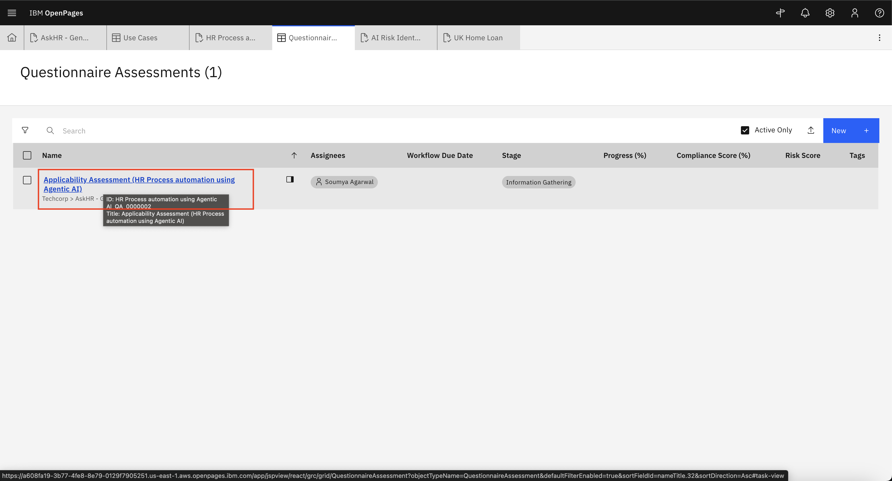  

* Fill out all required questions in the Compliance Assessment Questionnaire.

**Note**: 

👉 For most questions, select “Yes” if the risk or control is applicable. This ensures the risks get assigned and mapped properly in the assessment. e.g : Will the model input include content provided or created by people? answer yes in this part.
👉 Use “No” only when the risk or control clearly does not apply.
👉 If unsure, check the guidance notes or consult your risk team before leaving a field blank.
👉 Always review the final list of risks assigned after submission to confirm they reflect your business process.

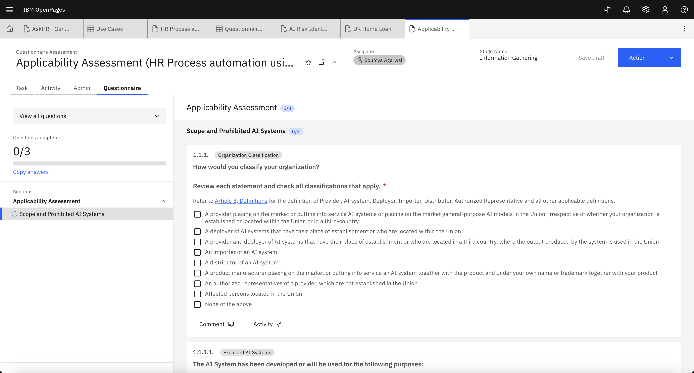  

* Use dropdowns, radio buttons, and text fields as applicable.

* Click **Submit and close** on Actions tab once all questions are answered.

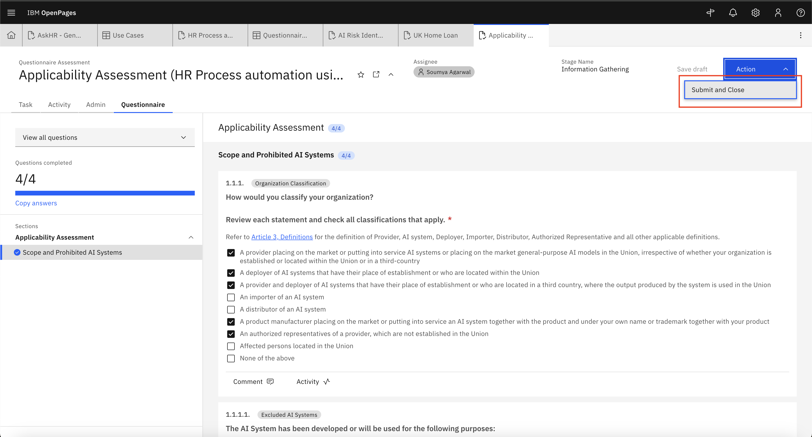  

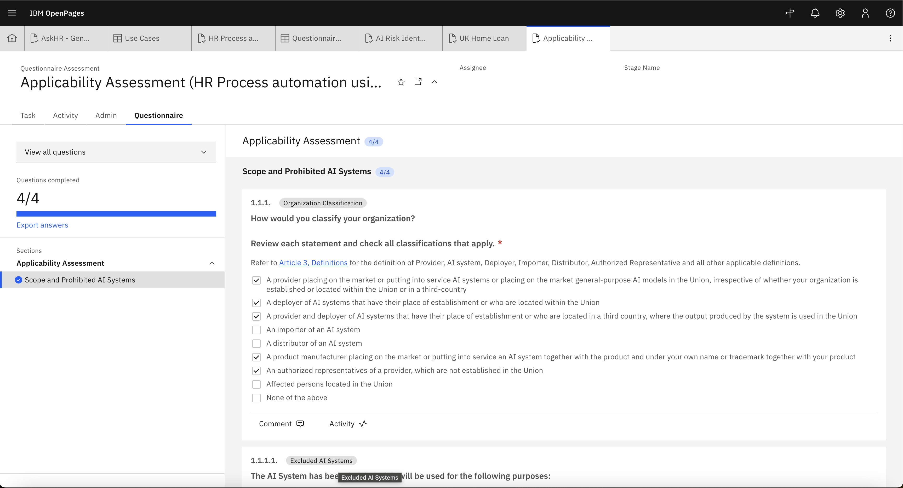  

✅ Once both assessments are submitted, the risks will be assigned for the use case.

- After the assesments Go back to your use case there you can See Risks associated in **Risk** List Section:

 

- You can also see the EU AI Risk Category automatically set after the applicability assessment in the use case In **regulatory information** section. Proceed to add the **mandates** tab and click on **Add**

 

- Select appropriate **Mandates or Risk & Compliance Act** and associate to the use case. Make sure that you select the **EU Artificial Intelligence Act**

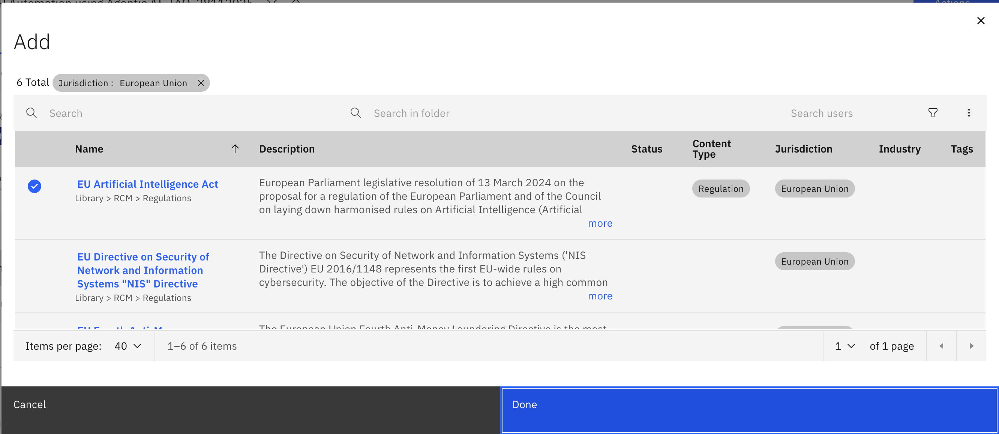 

-Now you can see in **mandates** section **Mandates or Risk & Compliance Act** are added.  Make sure that you select the **EU Artificial Intelligence Act**

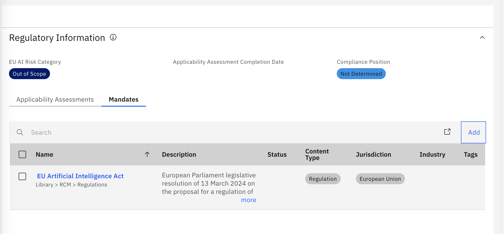 

Now you can proceed to the Risk assesment process by clicking on below link:

* [Review and Assess Risk](./risk-review-rco.md)

---

## 🎉 Well Done!

You have successfully created a **Model Use Case** and filled assesments in Watsonx.governance.

This enables:

* Structured governance
* Risk and compliance tracking
* Streamlined collaboration across stakeholders

Use Cases provide visibility, traceability, and control across the lifecycle of AI models.

---

[← Back to main guide](../../README.md)
[← Back to directory](../../guides-directory.md)

