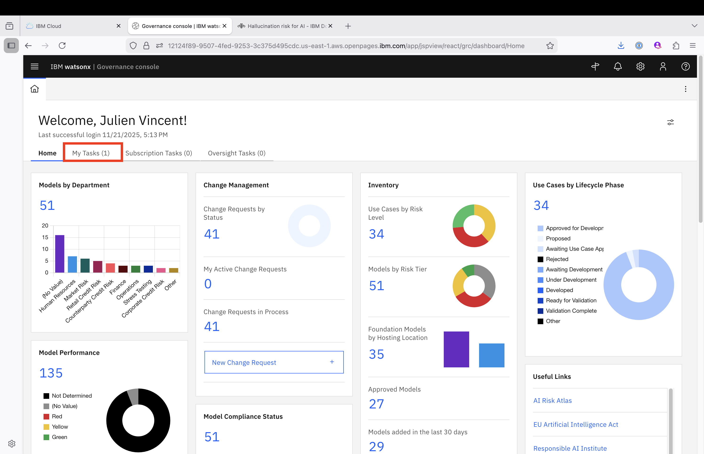
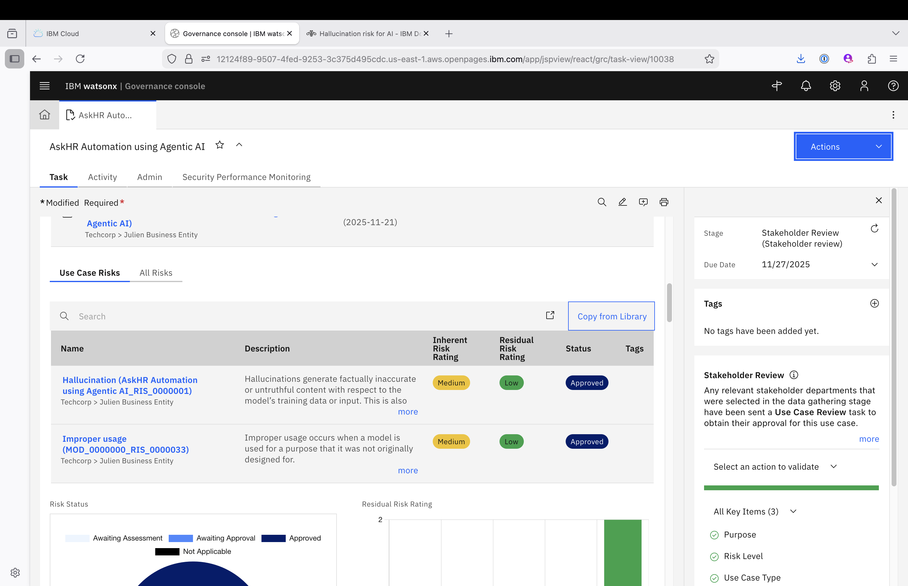
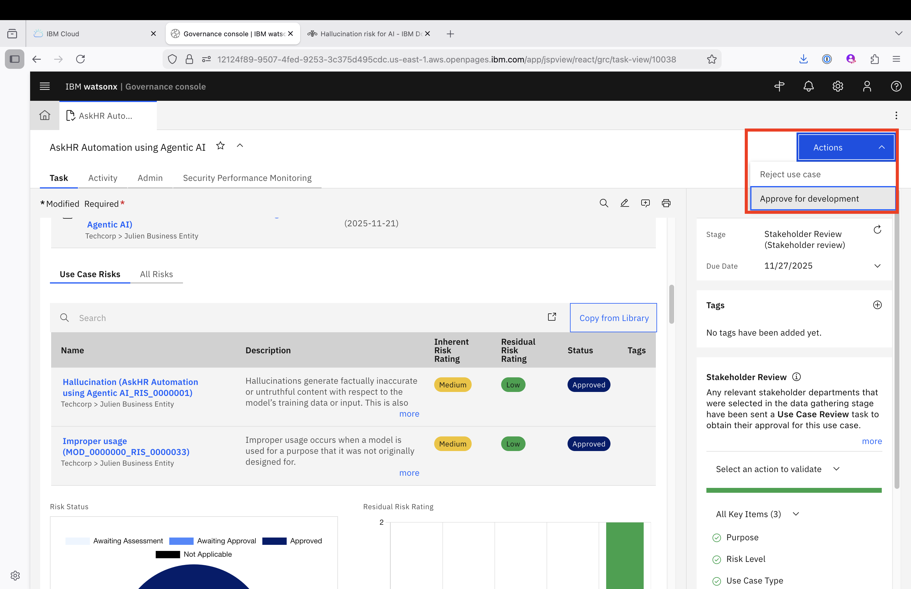

# 🏢 **Stakeholder review – Business Unit Leader**

> ⚠️ **Login Note:** Ensure you are logged into **IBM OpenPages** as a **Business Unit Leader** to complete this task.
> This role performs the **final risk endorsement** before the risk becomes officially active for controls and monitoring.

---

## 📝 Task Summary

You have received the task in **My Tasks** with **Use case** name:
**🗂️ “Use case Name- HR process automation using Agentic AI_< trigram >”**

As the Business Unit Leader, your role is to **approve or reject** a fully reviewed risk that has already passed through:

1. Risk Compliance Officer (RCO) review
2. Stakeholder validation

---

## ✅ Your Responsibilities

* Review all risk details submitted by the Use Case Owner
* Consider the inputs and approvals provided by previous reviewers
* Make the **final decision** for risk activation in OpenPages

---

## 🛠️ Steps to Complete

### 1️⃣ Open the Assigned Task

* Navigate to **My Tasks**
  

* Locate: **“HR process automation using Agentic AI”** which is **Usecase** name:

---

### 2️⃣ Review Risks associate with the UseCase

---

### 3️⃣ Approve or Reject the UseCase 

Go to actions and :

| Action    | Instruction                                     | Outcome                                   |
| --------- | ----------------------------------------------- | ----------------------------------------- |
| ✅ Approve | Set the **Status** to `Approved`                | Finalizes the risk for downstream linkage |
| ❌ Reject  | Set the **Status** to `Rejected` + add comments | Sends the risk back for revision          |

---

## 🎯 After You Submit

| If Approved                        | If Rejected                       |
| ---------------------------------- | --------------------------------- |
| Risk is now active                 | Sent back to Model Owner          |
| Can be linked to Controls & Issues | Requires updates and resubmission |

---

## 🎉 Thank You!

Your review ensures only **well-governed, risk-aligned initiatives** move forward—upholding business, regulatory, and operational integrity.

---

[← Back to main guide](../../README.md)

