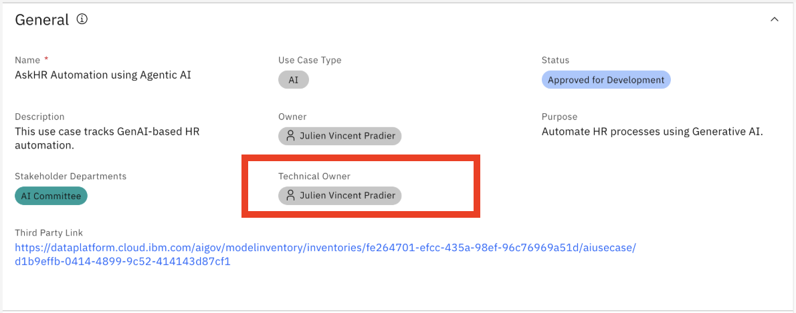
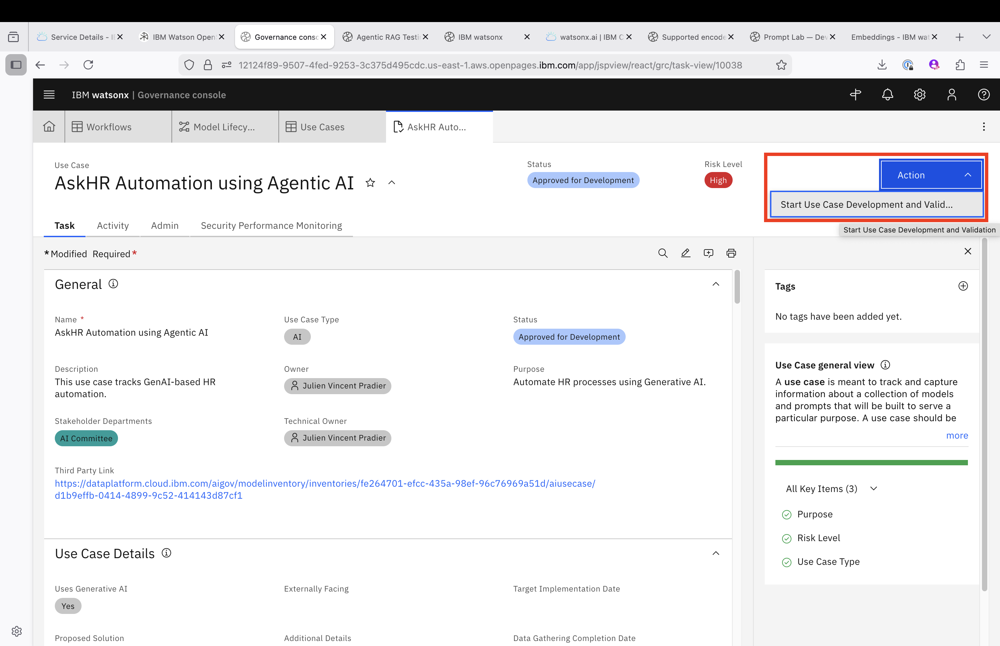
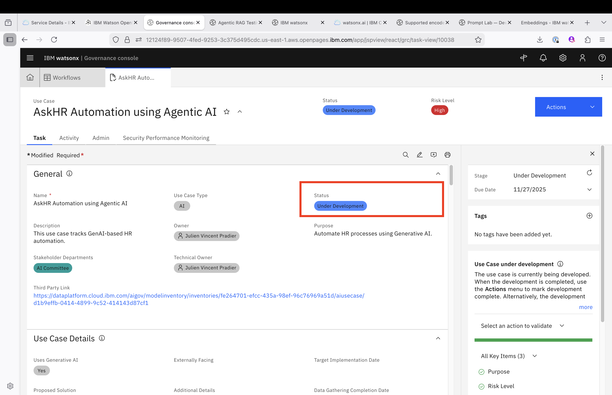
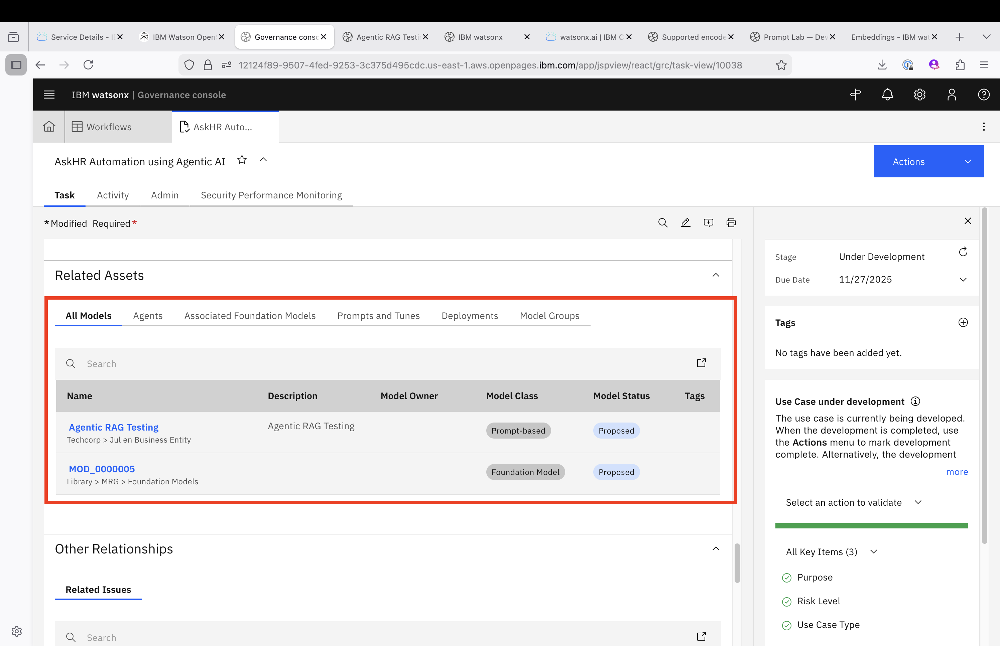
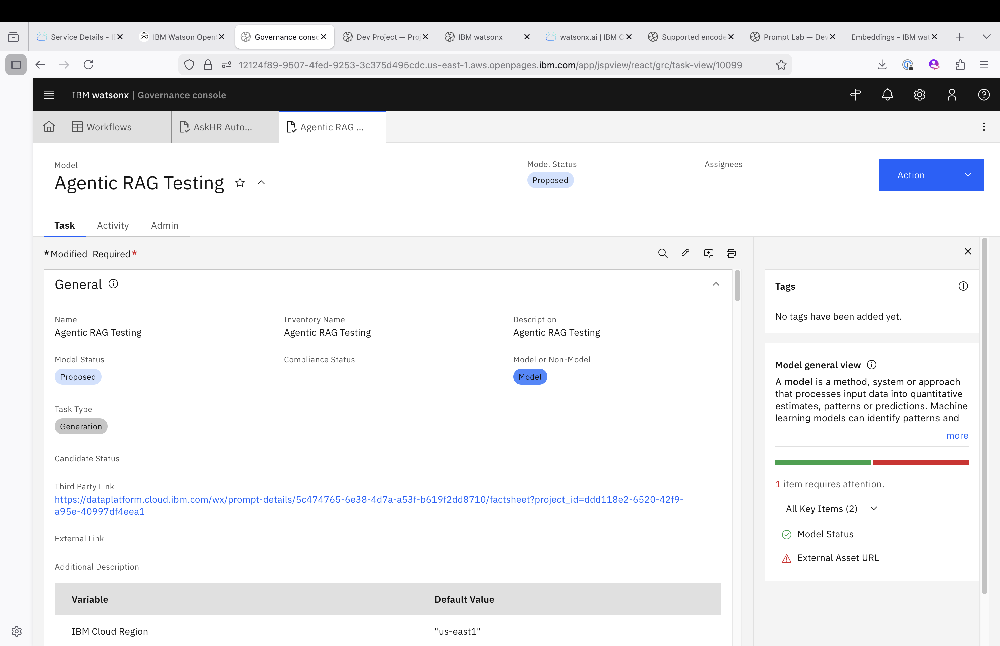
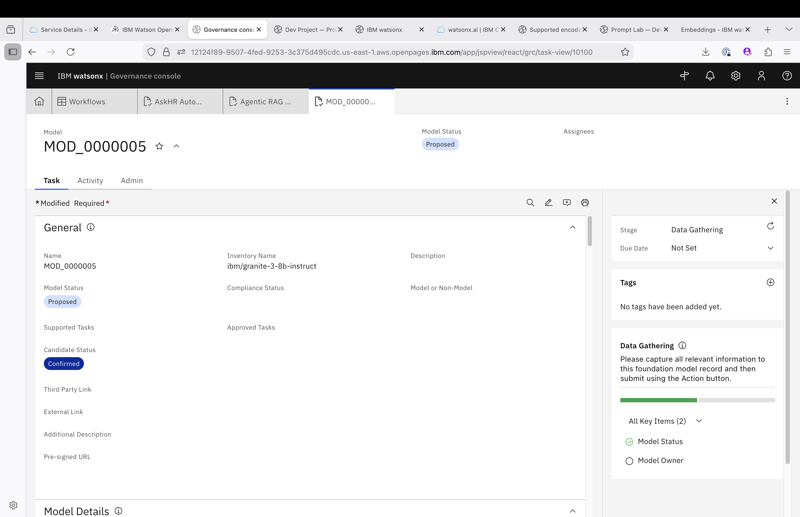
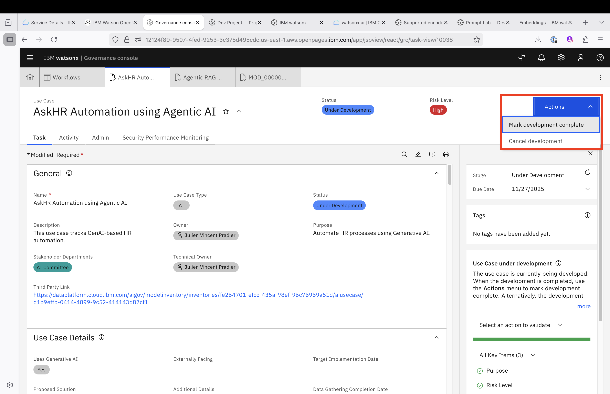
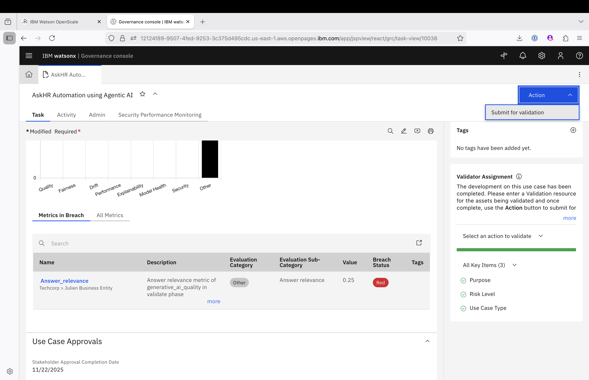

# Model Developer's Lab for AI Governance

## Overview

This guide contains the Model Developer's lab for AI Governance, focusing on automating HR policy question/answering processes using IBM watsonx capabilities.

## 1. Use Case

**Business Goal:** Automate question/answering process from HR policies using IBM watsonx **AskHR**, enabling faster HR policy question/answering while maintaining compliance in OpenPages.

---

## 2. Persona

**Model Developer:** Responsible for accessing the deployed Agentic RAG model, running evaluations, and integrating outputs into OpenPages.

---

## 3. Step-by-Step OpenPages Flow

### **Step 1 – Starting the development**

As a delevoper or developer manager, you will start the development process from the governance console.

Go back to the Use Case on the governance console. 

Access the Use Case, review the value of the field **technical owner**. If not set, set the value to yourself and click on Save:

The Use Case was approved for development, you were assigned or self-assigned this Use Case, just click on Action --> Start Use Case Developement and Validation process

This will kick-start the Development and Validation process:

Next, you need to actually perform the developement of the AI System behind the Use Case, following the requirements:

### 🧠 Agentic RAG Capabilities for HR Policy Q&A:

As a developer, you will need to fulfill there requirements to develop the UseCase:

1. Ingest and index HR policy documents (PDFs, DOCX, web pages, internal knowledge bases)
2. Allow users to ask natural language questions about HR policies (e.g., leave, benefits, conduct, compliance)
3. Retrieve relevant policies using semantic search
4. Generate clear, accurate answers grounded in official HR documentation
5. Highlight source references to support transparency and traceability
6. Support multilingual queries and inclusive language understanding

Please ask your instructor to perform the actual development of the AI System. If no available, refer to this [guide](./model-developement.md) to perform the actual development on watsonx.ai but also to document your developement and setup the right evaluation metrics.
We have streamlined all the work into a single Notebook.

> **Note:** After following the guide, the RAG model for this use case is **created and tested** in the AI environment (here watsonx).

> **Note:** The model chosen is the IBM OpenSource Model [Granite 4.0](https://huggingface.co/ibm-granite/granite-3.3-8b-instruct). The Granite models are provided by IBM. Key facts to take into account:
1. IBM Research Armonk, which is the entity delivering the Granite Models is a [ISO42001 Certified Organization](https://www.ibm.com/new/announcements/ibm-granite-iso-42001) 
2. IBM has signed the (General-Purpose AI Code of Practice)[https://digital-strategy.ec.europa.eu/en/policies/contents-code-gpai] to assess its conformity to EU AI Act Article 53.

---

### **Step 2 – Review the documentation automatically updated on the Governance Console**

Because watsonx is tighly integrated with Model Risk Governance, we were able to attach the new development to our Use Case within watsonx and that enables watsonx to directly update the Use Case in Model Risk Governance with the information coming from developement and testing. 

Go back to the Governance Console and to the Use Case, note that the status has changed to **Under development**

Scroll Down to the Models section, you should see two new entries:

Click on each of the entries:

First on the Prompt Template entry:

Notice the status is set to **proposed** and review all the information pushed from the ModelManagement module.

Secondly on the Model entry:

Notice the status is set to **proposed** and review all the information pushed from the ModelManagement module

### **Step 3 – Complete the development and testing phase and submit for validation**

As a model developer, if you are happy with your development, you can complete that phase in the Governance Console, that will notify Model Validators to start their work.

Go back to the Use Case, click on Actions --> Mark Development Complete

Click on Continue and close the tab

Next you can go back to the Use Case and **Submit for Validation**

### **Summary**

You have sucessfully completed the developpment of the Use Case:
1. You have attached your development to the UseCase from the Inventory
2. You have reviewed the documentation that was automatically populated.
3. You have selected a model from a Trustworthy provider IBM and have evaluated your developement with metrics adapted to the Use Case.

All this work have increased your chances to pass the validation and see your development be deployed to production.

---

[← Back to main guide](../../README.md)
[← Back to directory](../../guides-directory.md)

