# TODO - REMOVE OPENSCALE REFERENCE TO A SEPERATE OPTIONAL GUIDE

# 🧑‍🔬 Model Validator – AI Detached RAG sPrompt Performance & Quality Validation

> ⚠️ **Note:** Log in with the **Model Validator** role before accessing validation tools.

---

## 🔑 Accessing Detached RAG Prompt Validation Tools

1. Log in to IBM Cloud.
2. From the **Hamburger Menu (☰)**, navigate to **Instances**.
3. Select **openscale-defaultinstance**.
4. In the IBM Watson OpenScale dashboard, click **Open** (top right corner).

---

## 🎯 Validation Responsibilities

As a Model Validator, your primary role is to ensure **detached RAG prompts** meet performance, fairness, and quality standards, focusing on:

* **Fairness**
  Monitor and validate fairness metrics to detect bias against sensitive groups.

* **Alerts and Violations**
  Review alerts triggered by the system to investigate potential issues.

* **Quality Metrics**
  Assess overall **detached RAG prompt quality**, including precision, recall, and other key indicators.

* **Drift Detection**
  Track data, output, and prediction drift to ensure **detached RAG prompt stability** over time.

* **Global Explanation**
  Understand feature importance to validate **detached RAG prompt decision rationale**.

* **detached RAG prompt Performance Evaluation**
  Upload test datasets to evaluate **prompt outputs** against ground truth.

---

## 🔍 Validation Areas

### Fairness Validation

* Evaluate alerts related to fairness metrics (e.g., Disparate Impact, Statistical Parity Difference).
* Check alerts for sensitive groups (e.g., gender-based fairness).
* Investigate any violations flagged.

### Quality and Alerts

* Review alerts on quality metrics such as Precision, Recall, Accuracy, F1-Measure.
* Identify and address violations affecting **detached RAG prompt performance**.

### Drift Monitoring

* Observe drift alerts indicating changes in input data or **detached RAG prompt outputs**.
* Take action if drift impacts reliability.

### Generative AI Quality – Retrieval Augmented Generation (RAG)

* Assess alerts on answer quality and retrieval accuracy.
* Monitor content analysis metrics and data safety concerns.
* Investigate alerts indicating quality or safety issues in generated responses.
  
##First Task:(In Validation Phase) Platform : [Openscale](https://aiopenscale.cloud.ibm.com/)

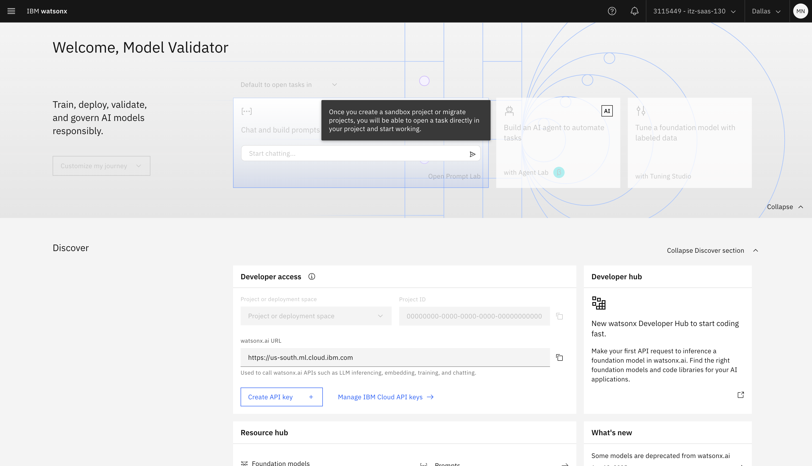

### Detached RAG prompt Performance Evaluation Using Test Data

1. In the OpenScale dashboard, click **Actions** > **Evaluate Now**.

   
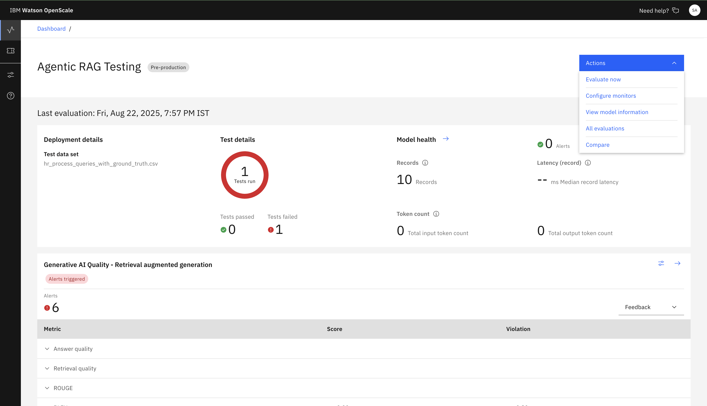

2. Upload this [dataset](./assets/hr_queries_with_ground_truth.csv) provided by your instructor that includes input features and expected output (ground truth).

   * Including **detached RAG prompt output**.
   * File constraints: Max size 8 MB, min 10 records, max 1000 records.

  
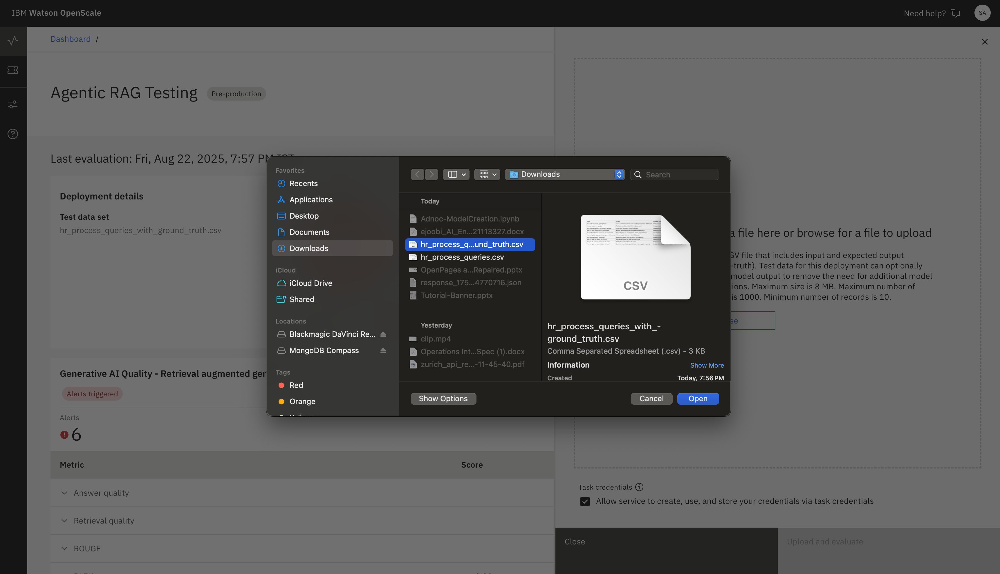 

3. Map all required fields from your uploaded csv.Click **Upload and Evaluate**.

. 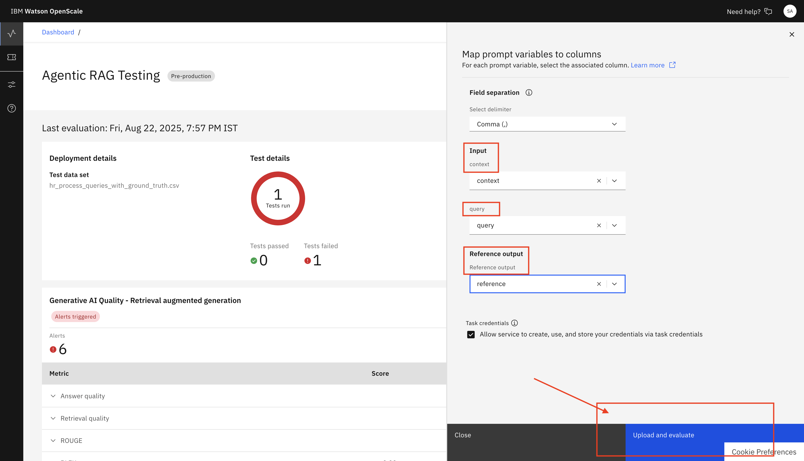 

4. Wait for evaluation to complete and review the results for accuracy and other metrics.

   
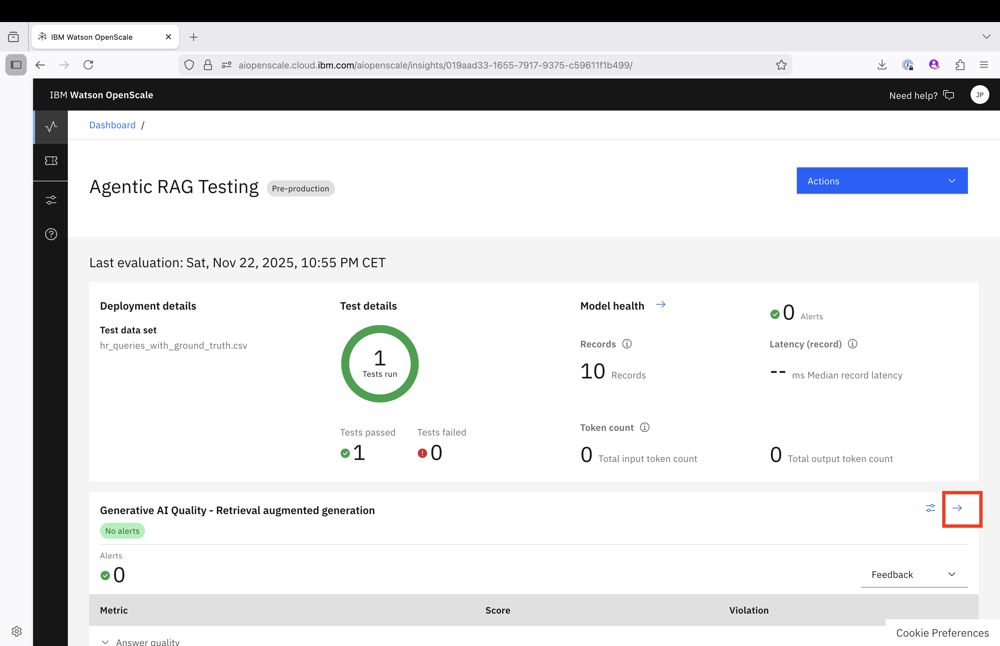 

###Second Task:(In Validation Phase) Platform:[Governance Console](https://a608fa19-3b7.us-east-1.aws.openpages.ibm.com/)

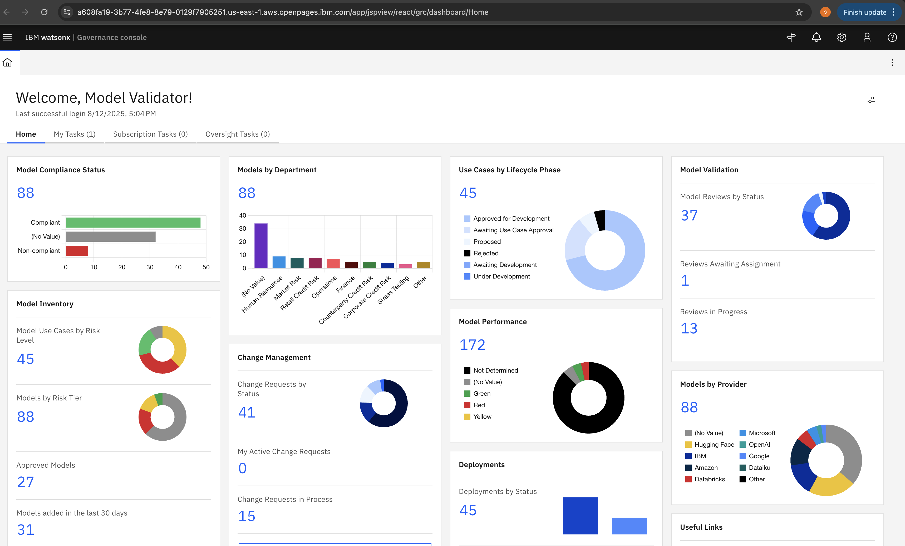

1.At home page page go to **My Tasks** Select **Agentic RAG Testing** detached prompt that is send by Model Developer for validation.

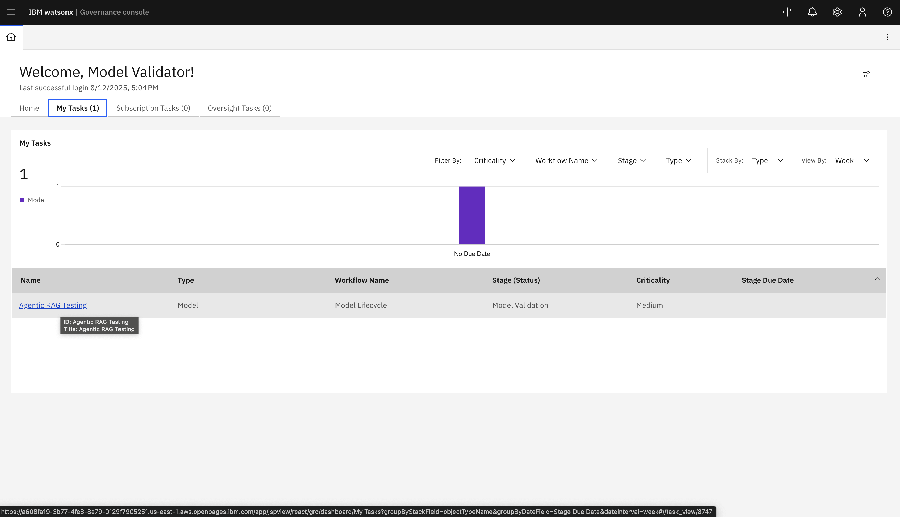

2.Review all fields and metrics added for asset and also add other mandatory fields.

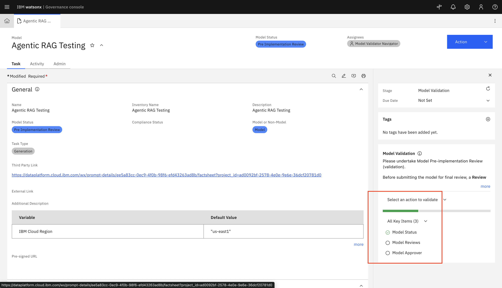

3.Click on **New Review** under Model Review section.

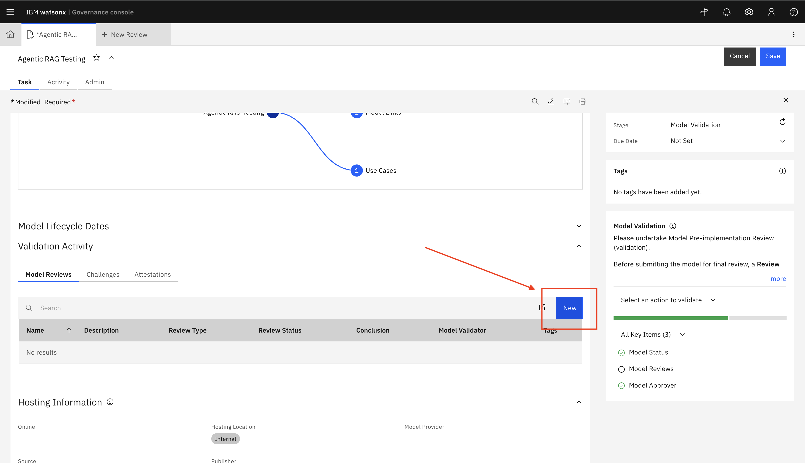

4.Fill all required fields as shown in Image below and click **Save**

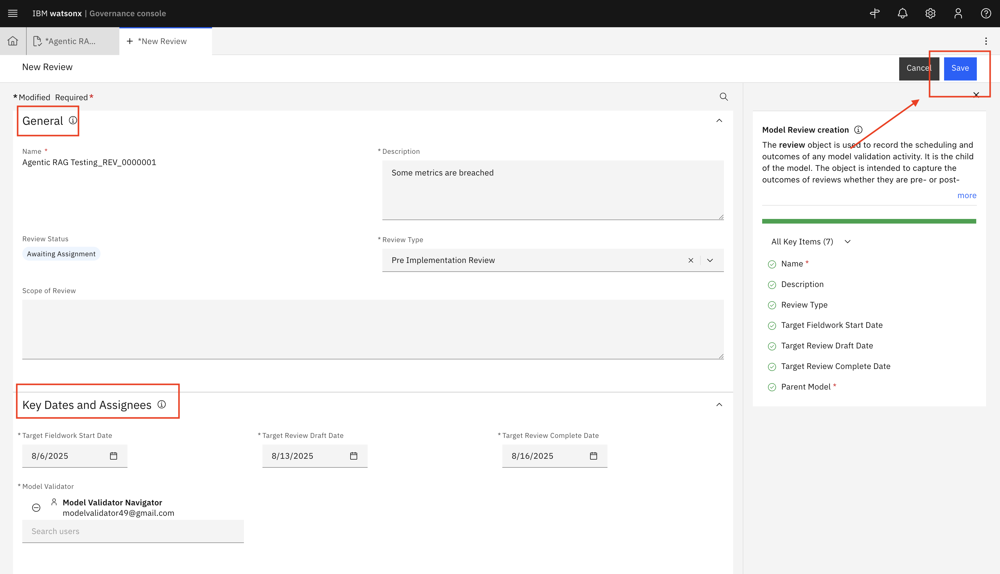

5.After that Review your Model Review and go back to asset.

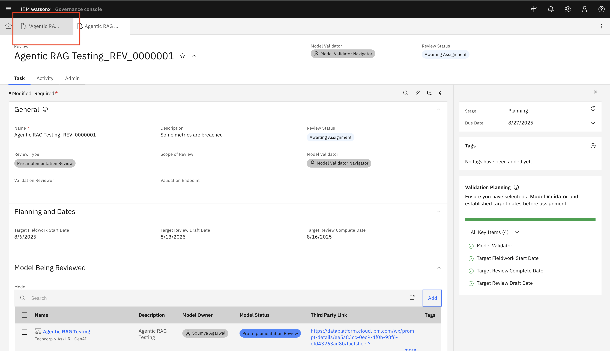

6.Click Save.

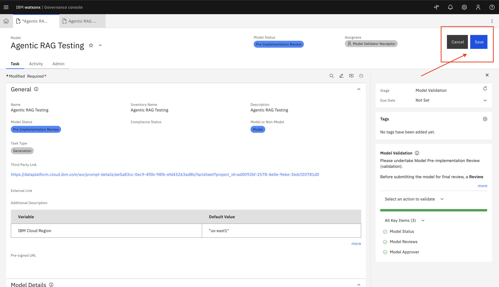

7.Go to Actions and **Submit for final approval**.

---

## ✅ Summary

Your validation work helps ensure that **detached RAG prompts**:

* Operate fairly without bias.
* Maintain high-quality performance.
* Adapt safely to changing data distributions.
* Generate reliable and compliant outputs.
* Meet expected performance benchmarks via test dataset evaluation.

---

## 🎉 Great Job!

By performing thorough validation, including test data evaluation, you support trustworthy, transparent, and ethical AI deployments!

---

[← Back to main guide](../../README.md)

