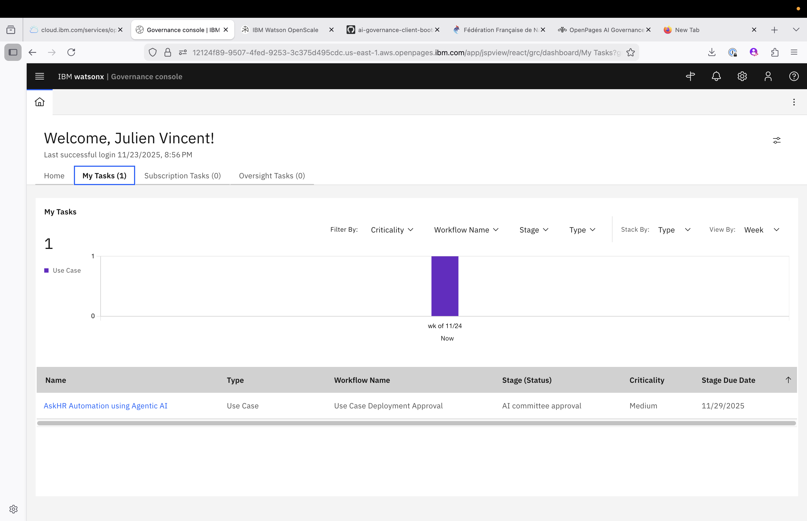
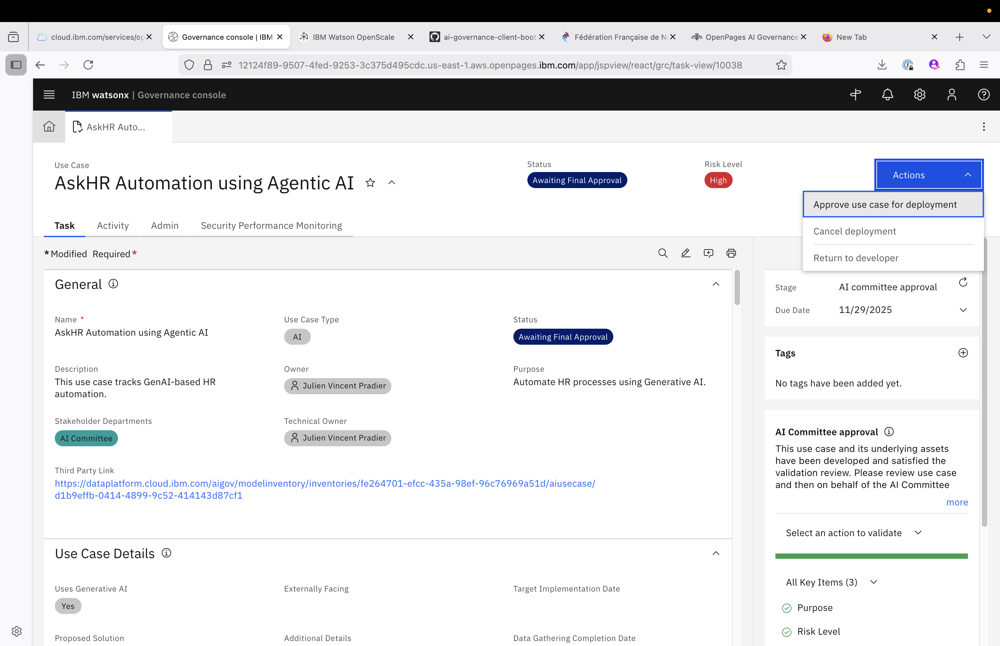
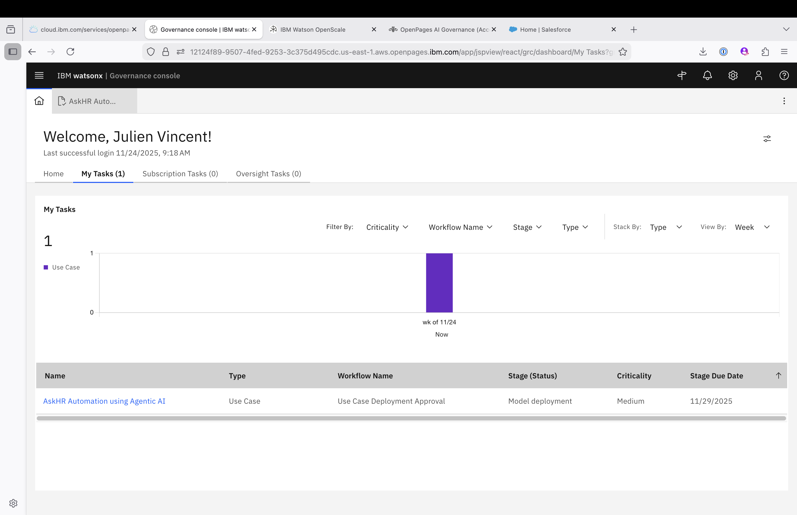

# 👨‍🔬 AIOps Engineer – Deploy and Track Model in Production

> ⚠️ **Note:** **AIOps Engineer** or **AI Engineer** are responsible to deploy the AI Systems to a production deployment space.
Please access this [Guide](./model-deployment.md) if you want to perform those task on watsonx, otherwise ask one of the instructor to perform the technical tasks for your behalf. As a **AIOps Engineer**, you are still responsible to document your deployment on the Governance Console. See Deployment Responsabilities below:

---

# 🎯 Deployment Responsibilities

As a **Model Deployer**, your primary responsibilities include:

- **Asset Management**  
  Promote and manage AI assets (prompts, models) to the correct deployment space.  

- **Deployment**  
  Configure and launch assets in production with proper naming and optional descriptions.  

- **Monitoring**  
  Track deployed AI in the **AI Use Case** view to ensure correct operation and performance.  

- **Documentation**  
  Review **AI Factsheets** to validate asset metadata, lineage, and compliance.  

- **Governance** 
  Update the Governance Console with the right deployment status 

---

# 🔍 Deployment Approval Workflow

Since the Model Validator have submitted the Use Case for Deployment Approval. The Use Case is now in the Deployment Approval Workflow

## 1️⃣ Approve Use Case for Deployment

Go to the home screen, on the **My Tasks**, you should find one task:

This task is not assigned to the **AIOps engineer** but to the **AI Committe**. You need one last review and approval before proceeding to the Deployement.

Impersonate the **AI Committe**, and approve the Use Case for deployement:

---
## 2️⃣ Deploy Asset

Go to the home screen, on the **My Tasks**, you should find one task:

Click on the task, **NOW** it's time to deploy the Use Case to a deployment space.
Feel like doing it, run through this [Guide](./model-deployment.md) to perform the actual deployment or ask one of the IBM instructor to perform the deployment on your behalf.

Once the deployment is done, confirm the deployment on the Governance Console:

---

# ✅ Summary

Following these steps ensures:

- Deployment got a last Approval from the AI Committee.  
- Deployment are being tracked and deployment is confirmed by the **AI Ops Engineer**

---

# 🎉 Congratulations!

By deploying and tracking your **Agentic RAG prompt**, you ensure **reliable, compliant, and production-ready AI services** for HR process automation!

---

[← Back to main guide](../../README.md) 
[← Back to directory](../../guides-directory.md)
 
