# 📊 Incident Management in OpenPages - Use Case Owner Guide

⚠️ **Login Note:** Before starting, ensure you are logged into IBM OpenPages with the **Use Case Owner** role. This is required to manage incidents, mitigate risks, and update stakeholders.

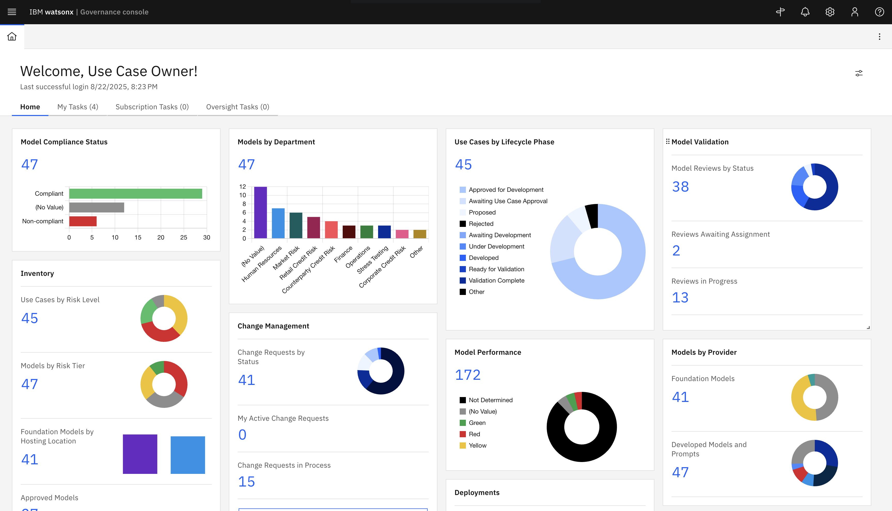

---

## 📌 What is Incident Management?
Incident Management in IBM OpenPages allows **Use Case Owners** to track, assess, mitigate, and communicate risks associated with model use cases or business processes. It provides a structured workflow for logging issues, assigning responsibilities, and ensuring timely resolution.

---

## 🎯 Why Manage Incidents?
- Mitigate risks efficiently.
- Keep stakeholders informed.
- Maintain audit-ready documentation.
- Ensure compliance and governance of AI/ML assets.

---

### 0️⃣ When and Who Creates an Issue
- **Who:**  
  - Typically, a **Use Case Owner**, **Risk Owner**, or other authorized personnel with access to the Use Case or model asset.  
  - In some organizations, issues may also be created by **auditors** or **compliance officers** if they identify a risk.
- **When:**  
  - When a **risk, incident, or non-compliance event** is identified related to a Use Case or model.  
  - Examples include:  
    - Model performance deviation  
    - Regulatory compliance breach  
    - Data quality or integrity issues  
  - The issue is logged to **track mitigation steps and notify stakeholders**.
    
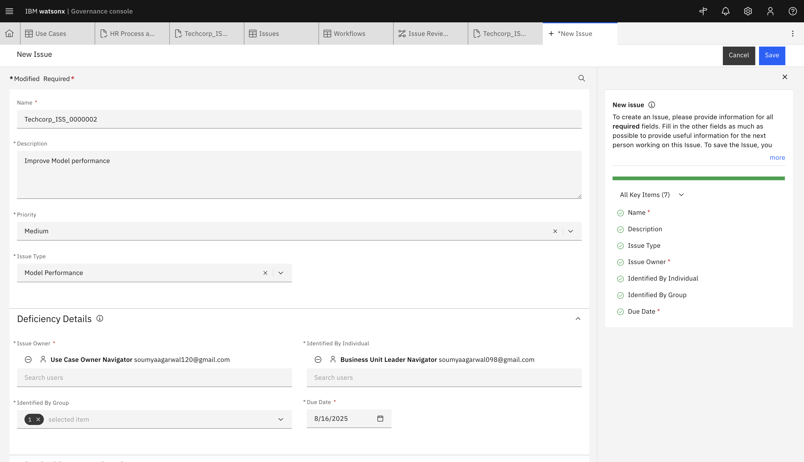

---

## 🛠️ Step-by-Step Guide

### 1️⃣ Navigate to the Remediation Section
- Click on the **Hamburger Menu (☰)** when logged in to IBM OpenPages as **Use Case Owner**.

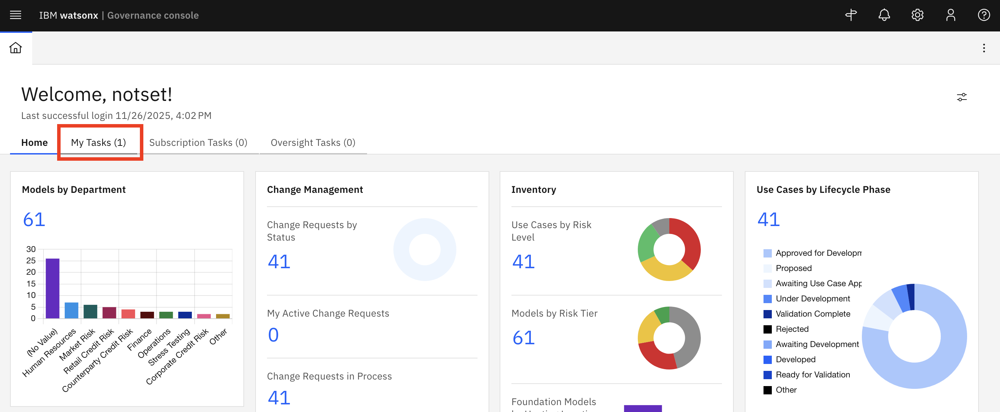

- Go to **Remedition** → **Issues**.

 
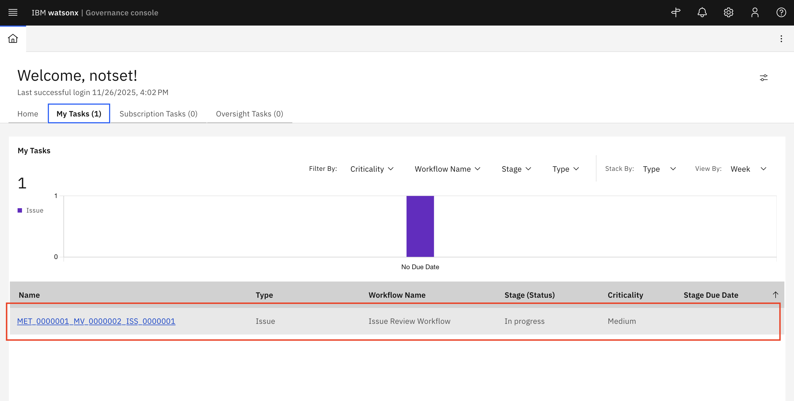

---

### 2️⃣ Select an Incident
- Browse the list of open incidents in the **Remediation** tab.
- Click on the incident you want to manage.

 
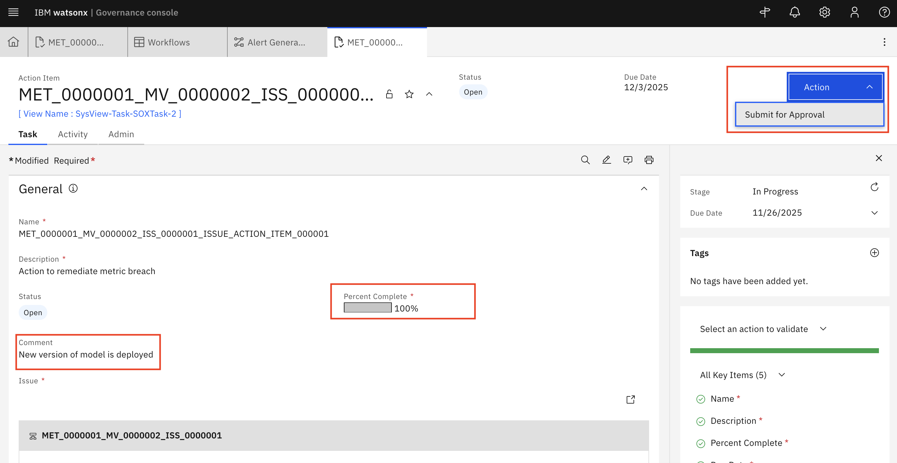

---

### 3️⃣ Assess Risk and Add Mitigation Actions
- Review the incident details.- Determine the **Issue Type**, **Issue Status**, **Who Identified the Issue**, **Priority**

  
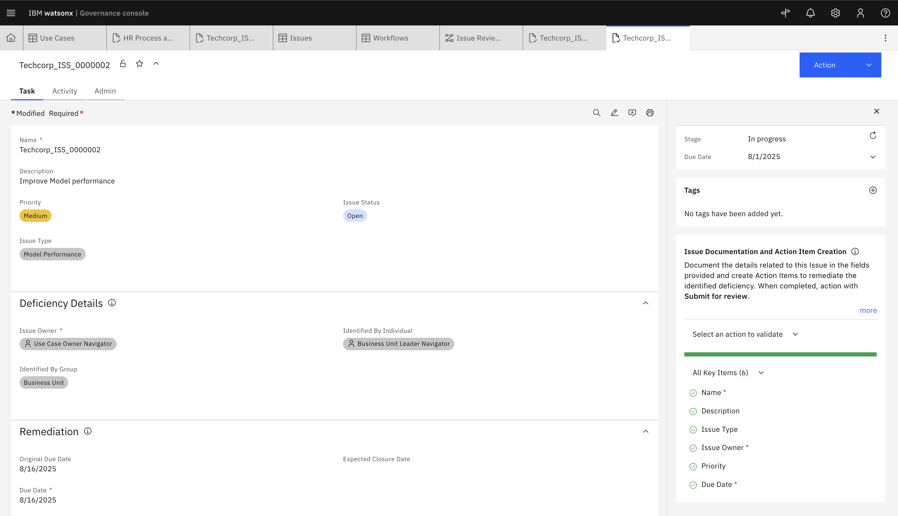

- Create Action Items to remediate the identified deficiency by clicking on **New Action**

  
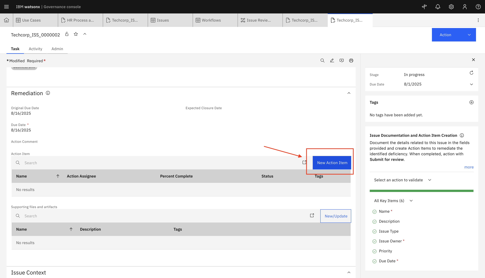

- Fill out all key details and click on **Save**

  
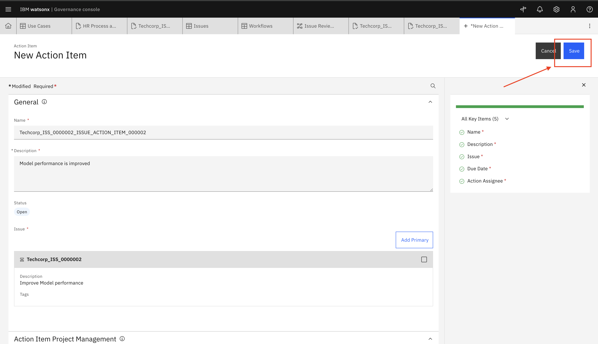

- Action has been created.

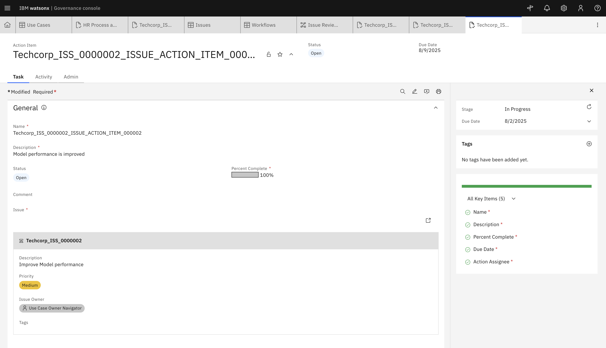
---

### 4️⃣ Submit for Review
- Now again in Issue section:
- Navigate to the **Actions** tab and Click on **Submit for Review**

  
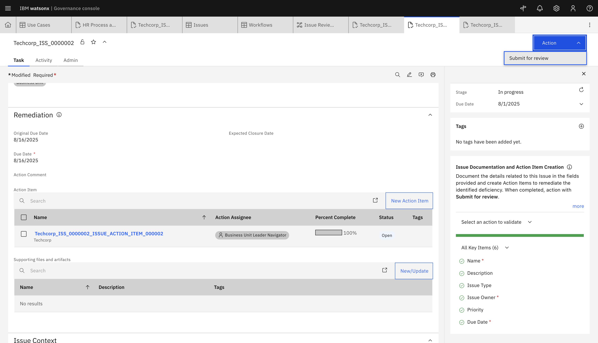

---

### 5️⃣ Close the Incident
- Once mitigation steps are completed and verified:
  - Change **Incident Status** to **Resolved / Closed**.

    
 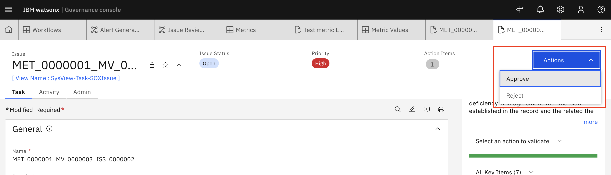   

  - Save updates and ensure stakeholders are informed.

    
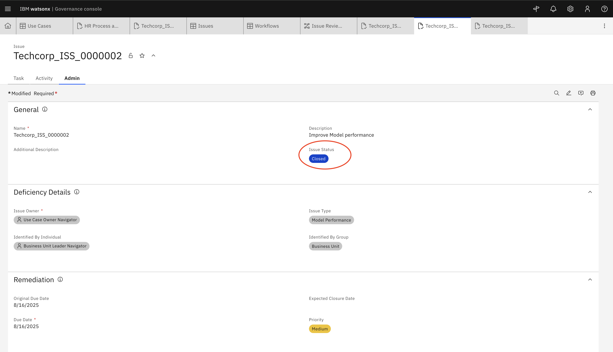

---

### ✅ Notes
- Always document each step for audit purposes.
- Use the remediation workflow to ensure accountability and traceability. Issue Review Workflow (Step7)
- Ensure all stakeholders are regularly updated on high-risk incidents.

---

[← Back to main guide](../../README.md#hands-on-lab) 
[← Back to directory](../../guides-directory.md)

