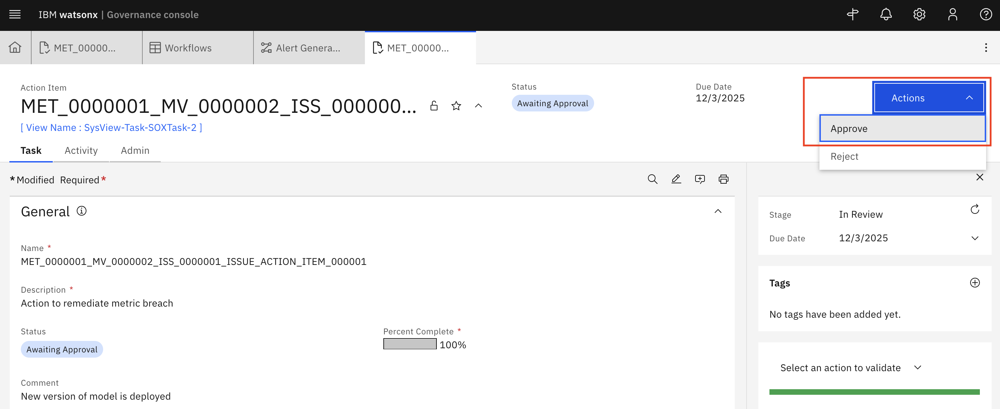

# 📊 Incident Management in OpenPages - Use Case Owner Guide

⚠️ **Login Note:** Before starting, ensure you are logged into IBM OpenPages with the **Use Case Owner** role. This is required to manage incidents, mitigate risks, and update stakeholders.

---

## 📌 What is Incident Management?
Incident Management in IBM OpenPages allows **Use Case Owners** to track, assess, mitigate, and communicate risks associated with model use cases or business processes. It provides a structured workflow for logging issues, assigning responsibilities, and ensuring timely resolution.

---

## 🎯 Why Manage Incidents?
- Mitigate risks efficiently.
- Keep stakeholders informed.
- Maintain audit-ready documentation.
- Ensure compliance and governance of AI/ML assets.

---

### 0️⃣ When and Who Creates an Issue
- **Who:**  
  - For seamless monitoring of AI assets, issues can be **created automatically** and assigned to the correct stakeholder when a model metric is in breach.
  - They can also be create by a **Use Case Owner**, **Risk Owner**, or other authorized personnel with access to the Use Case or model asset.  
  - In some organizations, issues may also be created by **auditors** or **compliance officers** if they identify a risk.
- **When:**  
  - When a **risk, incident, or non-compliance event** is identified related to a Use Case or model.  
  - Examples include:  
    - Model performance deviation  
    - Regulatory compliance breach  
    - Data quality or integrity issues  
  - The issue is logged to **track mitigation steps and notify stakeholders**.

In this lab, we will focus on a Model performance deviation issue.
    

---

## 🛠️ Step-by-Step Guide

### 1️⃣ Option 1: Run an evaluation on a deployed model

### 1️⃣ Option 2: Create a metric value manually

### 2️⃣ Navigate to your assigned tasks
- Click on the **My Tasks** tab when logged in to IBM OpenPages as **Use Case Owner**.

- Select an **issue** to remediate.

 

---

### 3️⃣ Assess Risk and Add Mitigation Actions
- Review the incident details.
- Determine the **Issue Type**, **Issue Status**, **Who Identified the Issue**, **Priority**

***Note***: You can view the related metric in the **Issue Context** section at the bottom of the Issue card.

  

- Create Action Items to remediate the identified deficiency by clicking on **New Action Item**

  

- Fill out all key details and click on **Save**

  

- Action has been created.

- Document the remediation steps undertaken, then clok on **Action** > **Submit for approval**

- Click on **Action** > **Approve** to approve the action item.

---

### 4️⃣ Submit for Review
- Navigate to the **Issue** tab:
- On the **Actions** tab, Click on **Submit for Review**

  

---

### 5️⃣ Close the Incident
- Go through the remaning steps of the workflow to close the incident via the **Actions** button:
  - Click on **Actions** > **Approve**, then click **Continue**
  - Click on **Actions** > **Close**, then click **Continue**
    
 

The issue is now marked as **Closed**

---

### ✅ Notes
- Always document each step for audit purposes.
- Use the remediation workflow to ensure accountability and traceability.
- Ensure all stakeholders are regularly updated on high-risk incidents.

---

[← Back to main guide](../../README.md#hands-on-lab) 
[← Back to directory](../../guides-directory.md)

